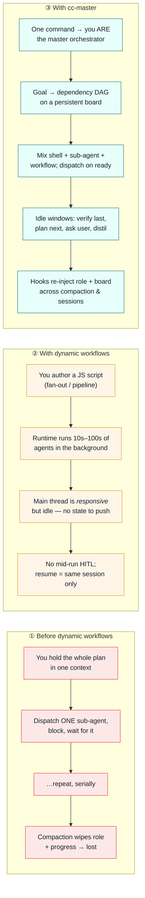

# cc-master

> 中文版见 [README_zh.md](README_zh.md)。

A ship-anywhere Claude Code plugin that turns any main-session agent into a long-horizon **master orchestrator**.

Point it at a goal that spans more than 24 hours of work. It picks the right dynamic-workflow paradigm, writes stable parallel scripts, and keeps the main thread *productively* advancing — dispatching background work and using idle windows with initiative — all while surviving repeated context compaction and cross-session resume.

---

## Why it exists: three paradigms, side by side

Dynamic workflows (shipped with Opus 4.8) gave Claude Code real parallelism. But for a *long-horizon* goal, two gaps remain: the official model only promises the main session stays **responsive** (not blocked), never that the orchestrator stays **productive** (self-driving); and nothing carries your role and progress across compaction. cc-master fills exactly that gap.

Here is the same long goal — *"migrate 9 domains to a new schema"* — run three ways:



|  | ① Before | ② Dynamic workflows | ③ cc-master |
|---|---|---|---|
| **Parallelism** | One sub-agent at a time | Tens–hundreds of agents | Shell + sub-agent + workflow, mixed |
| **Main thread while waiting** | Blocked, or doing it by hand | Responsive but idle | Proactive: verify · look-ahead · HITL · distil |
| **Survives compaction** | No | No | Yes — role + board re-injected |
| **Cross-session resume** | No | Same-session only | Yes — re-discovered from the board file |
| **Endpoint verification** | Ad hoc | Inside the script | Orchestrator verifies independently |

cc-master doesn't replace dynamic workflows — it *wraps* them. The workflow runtime is one of the three background mechanisms it conducts.

---

## Install

```bash
git clone https://github.com/nemori-ai/cc-master.git
ln -s "$(pwd)/cc-master" ~/.claude/plugins/cc-master
```

Then restart Claude Code (or run `/reload-plugins`) so the plugin is discovered.

## Usage

```
/cc-master:as-master-orchestrator <goal>   # bootstrap a board and become the orchestrator
/cc-master:status                          # render the board summary + validate the narrow waist
/cc-master:stop                            # archive the board and stand down (board is kept, not deleted)
```

Kick off `as-master-orchestrator` with a goal big enough to be worth it (think >24h of work, many independent units). The orchestrator decomposes it into a dependency graph, dispatches background work as dependencies clear, and keeps advancing the main thread until everything is done, verified, or waiting on you.

---

## How it works

The plugin is **commands + 2 skills + hooks + a board file**, and each piece has a distinct lifespan:

```
cc-master/
├── .claude-plugin/plugin.json          manifest
├── commands/
│   ├── as-master-orchestrator.md       bootstrap — become the orchestrator
│   ├── status.md                       summarize board progress / health
│   └── stop.md                         archive / mark the board inactive
├── skills/
│   ├── orchestrating-to-completion/    Skill A — the orchestration method (the soul)
│   └── authoring-workflows/            Skill B — how to write workflow scripts
└── hooks/
    └── scripts/{bootstrap-board, verify-board, reinject}.sh
```

- **Commands** are one-shot ignition — you trigger them; they inject the "I am the master orchestrator" philosophy and operating discipline, and open the board.
- **Skills** are the on-demand deep manuals — Skill A when you run the orchestration loop, Skill B when you write a workflow script.
- **Hooks** are the memory that survives compaction — after a context wipe (or on notification), they re-inject "you are the orchestrator + here is your board" so the role and the to-do list don't get forgotten.

### The board

The board is the orchestrator's **persistent save file** for a long task — a status-bearing task dependency graph. It is both the memory that survives compaction *and* the only window a hook (a shell, blind to agent context) can read. Boards live in a configurable home — `$CC_MASTER_HOME` if set, else `<project>/.claude/cc-master/` — and each orchestration gets its own time-sortable file, so concurrent runs never collide. It is the single source of truth (the built-in `Task*` tools are at most a non-authoritative draft mirror), and it's gitignored.

### The three background mechanisms it teaches

cc-master coaches the orchestrator to advance the main thread using three reliably ship-anywhere mechanisms:

1. **Background shell** — long-running commands launched detached, so the main thread keeps moving.
2. **Sub-agent (`run_in_background`)** — an independent, terminal reasoning task, integrated on completion.
3. **Workflow** — dynamic-workflow scripts (fan-out / pipeline / loop) for structured parallel orchestration.

It deliberately does **not** use **agent-teams** or **scheduled routines**: neither is reliably ship-anywhere (one is behind an experimental flag, the other needs a claude.ai account and isn't available on Bedrock/Vertex/Foundry), so they are out of scope by design.

### Bootstrap, guaranteed in three layers

Board existence does not depend on the agent cooperating:

1. **`UserPromptSubmit`** detects the command's sentinel → deterministically creates an empty board skeleton + injects its exact path and the orchestrator role.
2. **The agent** fills in the goal + DAG — the one non-mechanical step, anchored on a file that already exists.
3. **`Stop`** self-gates on the home: if an active board has zero tasks, it `block`s and demands a fix. (`SessionStart` is what re-injects role + board after every compaction and on resume.)

---

## Contributing & tests

The test suite covers the hook scripts (bash) and the content contract (Node's built-in test runner — board schema, skill/command structure):

```bash
./run-tests.sh
```

Requires Node 22+ and bash. The harness itself is the authoritative validator for workflow scripts, so there is intentionally **no** separate workflow linter to maintain — see [`skills/authoring-workflows/SKILL.md`](skills/authoring-workflows/SKILL.md) §3 for the reasoning.

When contributing: keep the board's **narrow waist** (the small set of hook-dependent fields) stable, keep the two skills self-contained and non-overlapping (Skill A = main-thread orchestration, Skill B = inside-the-script authoring), and run the suite before opening a PR.

---

## Acknowledgements

This plugin stands on the shoulders of the people who mapped this terrain first:

- **[Claude Code](https://code.claude.com/docs/en/workflows) (Anthropic)** — for the dynamic-workflow runtime itself, and for [`/deep-research`](https://claude.com/blog/a-harness-for-every-task-dynamic-workflows-in-claude-code), the bundled reference implementation of the fan-out → adversarial-verify → synthesize paradigm. The harness's own launch-time and runtime validation is what lets Skill B teach a contract instead of shipping a linter.
- **[ray-amjad/claude-code-workflow-creator](https://github.com/ray-amjad/claude-code-workflow-creator)** — the community's de-facto authoring skill. Skill B (`authoring-workflows`) borrows its overall shape: a procedural `SKILL.md` plus `references/{api-reference, patterns}` and `assets/{templates, examples}`.
- **[obra/superpowers](https://github.com/obra/superpowers)** — its `dispatching-parallel-agents` is one of the few places in the ecosystem that argues for *preserving the main agent's context for coordination work* — the seed of cc-master's "don't idle-spin" thesis. We also dogfooded the whole build under the superpowers discipline (brainstorming → plans → TDD → review).
- The community pattern libraries we distilled into Skill B's catalog — [alexop.dev](https://alexop.dev/posts/claude-code-workflows-deterministic-orchestration/), [claudefa.st](https://claudefa.st/blog/guide/development/dynamic-workflows), and Anthropic's [*A harness for every task*](https://claude.com/blog/a-harness-for-every-task-dynamic-workflows-in-claude-code).
- **[barkain/claude-code-workflow-orchestration](https://github.com/barkain/claude-code-workflow-orchestration)** — its *soft-enforcement* nudges ("don't let the main agent do the work by hand") are structurally kin to cc-master's red line that the conductor never plays an instrument.

The research that grounds the design is in [`design_docs/research/`](design_docs/research/).

---

## Learn more

- [`design_docs/spec.md`](design_docs/spec.md) — the full specification.
- [`design_docs/research/`](design_docs/research/) — the four reports behind the dynamic-workflow paradigms (mechanism, community, LLM-Compiler lineage, async-parallel methodology).

## License

[MIT](LICENSE) © 2026 cc-master contributors
