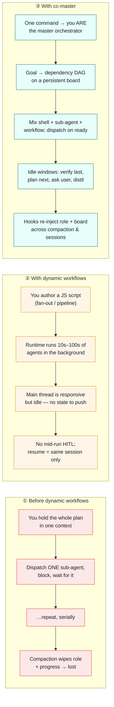

# cc-master

> 中文版见 [README_zh.md](README_zh.md)。


**Hand Claude Code a goal too big for one session — and let it conduct itself to the finish.**

A long-horizon goal shouldn't die at the next context compaction. You hand the agent two days of work; it makes real progress, the context fills, and one compaction later it has forgotten it was ever orchestrating — now it's *busy looking busy and shipping nothing*. cc-master is the layer that doesn't forget.

It's a ship-anywhere Claude Code plugin that turns any main-session agent into a long-horizon **master orchestrator**: it decomposes the goal into a dependency graph, dispatches background work in parallel, keeps the main thread *productively* advancing in every idle window, and survives repeated compaction and cross-session restarts without losing the thread. It is **not a framework** — just commands + 2 skills + hooks + one board file.

```
/cc-master:as-master-orchestrator <a goal worth >24h of work>
```

That one command bootstraps a persistent board and makes the session the orchestrator. **Sixty seconds from clone to running.** ↓ See exactly what you get vs. plain Claude Code.

---

## Three paradigms, side by side

Dynamic workflows (shipped with Opus 4.8) gave Claude Code real parallelism — fan out hundreds of agents from one script. But for a *long-horizon* goal two gaps remain: the official model only promises the main session stays **responsive**, never that the orchestrator stays **productive**; and nothing carries your **role and progress across compaction**. cc-master fills exactly that gap — it doesn't replace dynamic workflows, it *wraps* them.

Here is the same long goal — *"internationalize an app into 6 locales"* — run three ways:



Every claim in column ③ is anchored to a real mechanism, not a marketing line:

|  | ① Before | ② Dynamic workflows | ③ cc-master | ③ is backed by |
|---|---|---|---|---|
| **Parallelism** | One sub-agent at a time | Tens–hundreds of agents | Shell + sub-agent + workflow, mixed | the three background mechanisms |
| **Main thread while waiting** | Blocked, or doing it by hand | Responsive but idle | Proactive: verify · look-ahead · HITL · distil | the decision program (Skill A) |
| **Survives compaction** | No | No | **Yes** — role + board re-injected | `reinject.sh` (SessionStart hook) |
| **Cross-session resume** | No | Same-session only | **Yes** — re-discovered from the board file | the board (persistent save file) |
| **Endpoint verification** | Ad hoc | Inside the script | Orchestrator verifies independently | lens 6 + the decision program (Skill A) |
| **Quota awareness** | No | No | **Yes** — account-authoritative 5h/**7d** `used_percentage` (captured from the status line; local-derived 反推 as fallback) | `usage-pacing.js` (Stop hook) + `statusline-capture.js` + `cc-usage.sh` |

---

## Watch one run, start to finish

The fastest way to understand cc-master is to watch one orchestration happen — and to see it exercise more than one capability at once. A real long goal goes in; a persistent board, model-tiered parallel workers, a decision routed to *you*, an on-the-fly escalation, quota-aware pacing, and an independently-verified finish come out. Every board JSON below is a **real snapshot** of the file the orchestrator keeps on disk — the same one a hook reads when it decides whether you're allowed to stop.

> **The goal:** *Internationalize the web app to 6 locales — stand up the i18n framework, extract every hardcoded string, translate per locale, and ship locale routing.* — shaped exactly like the real thing: one shared foundation, then independent per-locale work that wants to run in parallel, plus one call only a human can make.

**Beat 1 — One command builds the board.** `UserPromptSubmit` sees the command's sentinel and runs `bootstrap-board.sh`, which creates the board file *before the agent does anything* and hands its path back: *"a fresh orchestration board was created at `<home>/…board.json` … Decompose the goal into a dependency DAG and write `tasks[]` … then run the decision program."* Bootstrap doesn't trust the agent to remember to keep state — it hands one over.

**Beat 2 — Decompose, tier the models, surface what's yours.** The conductor turns the goal into a DAG: a critical-path root `T0` (set up the i18n framework + extract strings) that everything depends on — run on a **strong model** — and independent locale leaves `de` / `ja` / `ar` on **cheaper models** (strong on the critical chain, cheap on the float). One call isn't the orchestrator's to make — *translate product terms or keep them in English? formal or informal register?* — so it lands as a `blocked_on:"user"` node and is surfaced to you **immediately**, in parallel with everything else.

```json
// INITIAL — root in flight; locale leaves blocked on it; one decision routed to you
{
  "schema": "cc-master/v1",
  "goal": "Internationalize the app to 6 locales (i18n framework + per-locale translation + locale routing)",
  "owner": { "active": true, "session_id": "smoke-session-001", "heartbeat": "2026-06-08T10:00Z" },
  "git": { "worktree": "/repo/.worktrees/i18n", "branch": "feat/i18n-rollout" },
  "wip_limit": 4,
  "tasks": [
    { "id": "T0", "status": "in_flight", "deps": [], "model": "opus", "title": "i18n framework + string extraction" },
    { "id": "de", "status": "blocked", "deps": ["T0"], "blocked_on": "T0", "model": "haiku", "title": "translate locale: de" },
    { "id": "ja", "status": "blocked", "deps": ["T0"], "blocked_on": "T0", "model": "haiku", "title": "translate locale: ja" },
    { "id": "ar", "status": "blocked", "deps": ["T0"], "blocked_on": "T0", "title": "translate locale: ar (RTL)" },
    { "id": "D1", "status": "blocked", "deps": [], "blocked_on": "user", "title": "glossary + register decision" }
  ]
}
```

**Beat 3 — It survives a compaction (the hard part).** A long task means the context fills and compaction drops "I am an orchestrator" *entirely* — the agent can't re-inject that for itself, because the memory that it had a role is what got wiped. On `SessionStart` (including `source:compact`), `reinject.sh` re-injects from **outside** the context: *"You are a cc-master master orchestrator. Your board(s) live in `<home>` … recognise it by its goal … Do not restart work already done/verified; integrate any completed background results first."* The board carried the *progress*; the hook carried the *identity*.

**Beat 4 — Dispatch on ready — and adapt.** `T0` lands, verified at the endpoint (the conductor reads the diff itself — a green gate is *not* a pass). The locale leaves flip `blocked → ready` and dispatch in parallel under `wip_limit: 4`. Then the plan meets reality: `ar` isn't just translation — right-to-left layout needs real work — so the conductor **escalates** it to a `workflow` and re-plans, rather than forcing a leaf that no longer fits. Meanwhile `usage-pacing.js` notices the run nearing the 5h quota wall and injects a **non-blocking** nudge; the conductor throttles — lowers WIP, defers the lowest-priority locale — instead of redlining. And if it tried to end the turn with `ready` work still on the board, `verify-board.sh` stops it cold: *"this board still has a `ready` task … Resolve it before stopping."*

**Beat 5 — Independent acceptance, then a forced self-check.** The leaves finish and are each independently verified (the conductor checks the rendered locale, not the worker's self-report). The board *looks* done — so the agent tries to stop. **The most important hook moment:** the goal-hook won't take "done" on faith. On the first stop in a completion state it blocks once and forces a self-check against the *original goal* — and it surfaces that your glossary decision is **still unanswered**: *"(1) Is every point that needs the user surfaced / marked `blocked_on:"user"`? (2) … is every to-do actually done?"* "Done" is refused while a decision is still owed to you.

```json
// DONE — every work node verified; the user decision was answered and applied
{
  "schema": "cc-master/v1",
  "goal": "Internationalize the app to 6 locales (i18n framework + per-locale translation + locale routing)",
  "owner": { "active": true, "session_id": "smoke-session-001", "heartbeat": "2026-06-08T12:30Z" },
  "wip_limit": 4,
  "tasks": [
    { "id": "T0", "status": "done", "deps": [], "verified": true },
    { "id": "de", "status": "done", "deps": ["T0"], "verified": true },
    { "id": "ja", "status": "done", "deps": ["T0"], "verified": true },
    { "id": "ar", "status": "done", "deps": ["T0"], "mechanism": "workflow", "verified": true },
    { "id": "D1", "status": "done", "deps": [], "title": "glossary + register decision (answered)" }
  ]
}
```

**Want the runnable proof?** The hook chain narrated here — bootstrap, reinject, and every `verify-board` block/allow decision — is exercised end-to-end by `smoke.sh` (all three are bash hooks, so the smoke run itself needs no jq, no node, no network), which prints *what happened* and *what the hook decided* plus a PASS/FAIL exit code (it doubles as a CI smoke check):

```bash
bash examples/sample-orchestration/smoke.sh
```

The full step-by-step story, with every board snapshot, is in [`examples/sample-orchestration/walkthrough.md`](examples/sample-orchestration/walkthrough.md).

---

## Quickstart

Two supported ways to run cc-master. Pick by how you work — both require **Node 22+** and **bash**, nothing else.

### A. `--plugin-dir` — recommended (dev / dogfood)

Point Claude Code straight at a live clone. Edits to the repo take effect on the next session — **no cache, no copy step**. This is how the maintainers run it.

```bash
git clone https://github.com/nemori-ai/cc-master.git
cd cc-master
claude --plugin-dir .          # this session loads the plugin from the live repo
```

`claude --plugin-dir /abs/path/to/cc-master` works from anywhere, so you can dogfood cc-master while inside *another* project.

### B. Marketplace + `enabledPlugins` (team / stable)

Add the marketplace, then enable the plugin in your settings. This is the right choice for sharing one pinned version across a team. **Trade-off:** enabled plugins are copied into Claude Code's plugin cache, so live edits to your clone do **not** take effect — you must `claude plugin update` to pick up changes.

```bash
# add this repo as a marketplace (URL, path, or GitHub repo all work)
claude plugin marketplace add nemori-ai/cc-master
claude plugin install cc-master@cc-master
```

Or enable it declaratively in settings. The `enabledPlugins` value is an **object** keyed by `<plugin>@<marketplace>` (not an array):

```jsonc
// ~/.claude/settings.json
{
  "enabledPlugins": {
    "cc-master@cc-master": true
  }
}
```

> Quick rule: iterating on the plugin → `--plugin-dir` (live). Pinning a version for a team → marketplace + `enabledPlugins` (cached).

Once loaded, hand it a goal big enough to be worth it (think >24h of work, many independent units). The full command set:

```
/cc-master:as-master-orchestrator <goal>           # bootstrap a board and become the orchestrator
/cc-master:as-master-orchestrator --resume [sel]   # pick up an EXISTING board in a new session (see below)
/cc-master:status                                  # render the board summary + validate the narrow waist
/cc-master:handoff-to-new-session                  # gracefully hand the board off to a fresh session (write side of --resume)
/cc-master:stop                                    # archive the board and stand down (board is kept, not deleted)
```

### Resume an existing board in a new session

A long-horizon orchestration outlives any single session. When the original session is closed / crashed / you're on another machine — or you ran `/cc-master:stop` and changed your mind — `--resume` lets a **brand-new session take over an existing board** instead of starting from scratch:

```
/cc-master:as-master-orchestrator --resume                 # one resumable board → pick it; else list candidates
/cc-master:as-master-orchestrator --resume i18n            # select by goal substring, board filename, or timestamp prefix
/cc-master:as-master-orchestrator --resume i18n --force-takeover   # confirm taking over a board that still looks alive
```

- **Any board is resumable** — both still-`active` (abandoned) boards and `/stop`-**archived** ones. Resuming an archived board **revives** it (`active:false → true`). `/stop` is a *reversible archive*, not a permanent end-state; the board file, its `tasks`, `log`, and `goal` are all preserved across archive → revive.
- **Takeover is safe by default.** Re-stamping the board hands it to the new session and orphans the old one's background work — so if a board still *looks alive* (recent heartbeat / file mtime), `--resume` warns and **withholds** the takeover until you re-send with `--force-takeover`. Ambiguous or missing selector → nothing is written; it lists the candidates (grouped into *abandoned* vs *will-be-revived*) and asks you to pick.
- **Resume means pick up, not restart.** The conductor reconciles the existing `tasks[]` rather than re-decomposing the goal, and treats any `in_flight` task left by the dead session as an orphan — endpoint-verifying its artifact (and marking it done) or re-dispatching it for a fresh handle, never idle-waiting on a dead handle. See [ADR-009](adrs/ADR-009-resume-cross-session-re-arm.md).

### Hand a board off cleanly before the session ends

`--resume` is the *read* side of cross-session continuity; `/cc-master:handoff-to-new-session` is the *write* side. Run it from the **old** orchestrator session to gracefully prepare a board for a **new** one, instead of leaving an abandoned board for `--resume` to discover after the fact:

```
/cc-master:handoff-to-new-session   # run in the OLD session to prepare a clean handoff
```

The conductor: (1) stops dispatching new work; (2) lets in-flight tasks finish and verify in the current session (stragglers that run too long are degraded to orphans + re-verify and surfaced to you); (3) writes a **narrative** handoff doc — a sidecar in the cc-master home that points at the board and explains the *story* without restating its DAG; (4) appends a pointer to that doc in `board.log`; (5) archives the board (`owner.active:false`) so the next session's `--resume` revives it frictionlessly; (6) tells you the doc path and the exact `--resume` command to run next. Handoff (prepare) and `--resume` (take over) are the two halves of one clean cross-session relay.

### Optional — turn on account-authoritative quota awareness

cc-master can pace against your subscription's **real** 5h/7d quota `used_percentage` — but that signal lives **only** in the status line's stdin (no hook, CLI, or file can reach it). Capturing it means wiring `statusline-capture.js` into your status line. Don't hand-edit `settings.json` — the **AI-native way** is to paste the prompt below to Claude Code and let it do the wiring (it resolves the real install path, preserves your existing status line via `--passthrough`, sidesteps the undocumented `${CLAUDE_PLUGIN_ROOT}`-in-`statusLine.command` question by using an absolute path, and verifies the sidecar lands):

> Help me enable cc-master's account-authoritative usage pacing. My subscription's 5h/7d quota `used_percentage` only appears in the **status line** script's stdin; cc-master ships `statusline-capture.js` to capture it into a sidecar (`~/.claude/.cc-master-rate-limits.json`) that its pacing hook and `cc-usage.sh` read. Please:
> 1. Locate the real absolute path of `statusline-capture.js` — it lives under the plugin's `skills/orchestrating-to-completion/scripts/`; the plugin may sit under `~/.claude/plugins/cache/.../` or be loaded via `--plugin-dir`, so use `find`/`ls` to resolve the actual path.
> 2. Read my current `statusLine.command` in `~/.claude/settings.json` (if any).
> 3. Rewrite `statusLine.command` to run `statusline-capture.js` first and `--passthrough` my original command, so my status-line display is unchanged. Use an **absolute path** (variable expansion in this field is undocumented). Show me the exact diff and let me confirm before you write it.
> 4. Then have the status line render once (I'll send a message), check that `~/.claude/.cc-master-rate-limits.json` was written with the right shape, and run the plugin's `cc-usage.sh` to confirm its `source` is `"account"` (not `local-derived-approx`).
> 5. If I'm on Pro/Max but `rate_limits` never shows up, tell me why (it only appears after the first API response, and only on Pro/Max).

Without this, pacing silently falls back to local-JSONL 反推 — an approximation whose reset countdown can be off by an order of magnitude ([Finding #37](design_docs/dogfood-findings.md)). Pro/Max subscriptions only; everywhere else this is a no-op and the fallback handles it.

---

## The six-vision charter (C1–C6)

cc-master **aims to** make a Claude Code agent into a master orchestrator across six capabilities. These are **goals that guide the design, not a claim that all six already ship** — the status column is honest about what's live today vs. still design-only:

| # | Capability | Status | How it's delivered today |
|---|---|---|---|
| **C1** | Drive a goal to full, async-parallel completion — not halfway, all the way | 🟢 Live | three background mechanisms + the decision-program loop + a `Stop` gate that forces "really all done" |
| **C2** | Control the *rate* of token burn — throttle, don't redline | 🟢 Live | `usage-pacing.js` (non-blocking warning on account 5h/**7d** `used_percentage`, captured via `statusline-capture.js`; local-derived fallback) + `cc-usage.sh` (out-of-band query, account-first) |
| **C3** | Hold the line between deciding autonomously and pulling in the human | 🟢 Live | red lines + `blocked_on:user` nodes + the `Stop` gate listing unanswered user decisions |
| **C4** | Decompose, manage, update, and re-plan the goal as it learns | 🟢 Live | the board DAG + CPM decomposition + resume flagging dangling `stale`/`escalated` nodes |
| **C5** | Maximize throughput *under* a sane burn rate | 🟢 Live | WIP cap (~75% utilization) + free float parallelism + `posttool-batch.sh` soft-warn |
| **C6** | Pick the right model by complexity, difficulty, and duration | 🟡 Partial | the **complexity/difficulty** axis is live (per-node `agent({model})` tier); the **duration** axis is still design-only |

> 🟢 Live · 🟡 Partial · ⚪ Design-only. Which capabilities are live vs. design-only is tracked in [`design_docs/vision-landing-tracker.md`](design_docs/vision-landing-tracker.md); the full charter is the single source of truth in [`design_docs/spec.md` §1.0](design_docs/spec.md).

---

## How it works

The plugin is **commands + 2 skills + hooks + a board file**, and each piece has a distinct lifespan:

```
cc-master/
├── .claude-plugin/
│   ├── plugin.json                     manifest
│   └── marketplace.json                marketplace entry (install path B)
├── commands/
│   ├── as-master-orchestrator.md       bootstrap — become the orchestrator
│   ├── status.md                       summarize board progress / health
│   ├── handoff-to-new-session.md       prepare a clean handoff to a fresh session
│   └── stop.md                         archive / mark the board inactive
├── skills/
│   ├── orchestrating-to-completion/    Skill A — the orchestration method (the soul)
│   └── authoring-workflows/            Skill B — how to write workflow scripts
└── hooks/
    └── scripts/{bootstrap-board, reinject, verify-board,    bash
                 posttool-batch}.sh +
                 usage-pacing.js                             node
```

- **Commands** are one-shot ignition — you trigger them; they inject the "I am the master orchestrator" philosophy and operating discipline, and open the board.
- **Skills** are the on-demand deep manuals — Skill A when you run the orchestration loop, Skill B when you write a workflow script.
- **Hooks** are the orchestrator's runtime — they survive compaction (re-injecting "you are the orchestrator + here is your board"), gate completion, soft-warn on over-dispatch, and sense the quota wall against the account's 5h/7d `used_percentage` (captured from the status line by `statusline-capture.js`; local-derived 反推 as fallback). They reach for `node` only where structured JSON parsing earns it (usage / rate-limit JSON), bash everywhere else ([ADR-006](adrs/ADR-006-hooks-may-use-node-js.md)).

### The three background mechanisms it teaches

cc-master coaches the orchestrator to advance the main thread using three reliably ship-anywhere mechanisms:

1. **Background shell** — long-running commands launched detached, so the main thread keeps moving.
2. **Sub-agent (`run_in_background`)** — an independent, terminal reasoning task, integrated on completion.
3. **Workflow** — dynamic-workflow scripts (fan-out / pipeline / loop) for structured parallel orchestration.

It deliberately does **not** use **agent-teams** or **scheduled routines**: neither is reliably ship-anywhere (one is behind an experimental flag, the other needs a claude.ai account and isn't available on Bedrock/Vertex/Foundry), so they are out of scope by design.

### Bootstrap and completion, guaranteed by hooks

The board never depends on the agent cooperating, and the orchestrator can't quietly quit early. The five hooks span four events:

1. **`UserPromptSubmit`** (`bootstrap-board.sh`) detects the command's sentinel → deterministically creates an empty board skeleton + injects its exact path and the orchestrator role. This is also the **arm action** (see below) — and with `--resume` it instead re-arms an *existing* board (the second arm form: stamp owner onto a selected old board, reviving it if archived; [ADR-009](adrs/ADR-009-resume-cross-session-re-arm.md)).
2. **`SessionStart`** (`reinject.sh`) re-injects role + board after every compaction and on resume — and on resume it flags any **dangling `stale`/`escalated` nodes** left from an un-reconciled plan update.
3. **`Stop`** (`verify-board.sh`) runs a pure-bash gate over *this session's* active board (filtered by `owner.session_id`, so concurrent orchestrations never interfere). An empty board, or one with `ready`/`uncertain` work left, **blocks** the stop; when the board looks done it forces a one-time **self-check against the goal** — surfacing any **unanswered `blocked_on:user` decisions** — before releasing, with a fuse (5 consecutive blocks) so a misjudgment can never wedge the agent.
4. **`Stop`** also runs `usage-pacing.js` (node): it prefers the **account-authoritative** 5h/7d `used_percentage` captured to a sidecar by `statusline-capture.js` (falling back to local-JSONL 反推 when the sidecar is absent), and injects a **non-blocking** pacing warning — **two-sided**: it nudges to throttle when a window nears its limit *and* nudges to accelerate when the 5h window is being under-used (so quota doesn't silently evaporate), with the 7d window as the hard ceiling on speeding up. It never blocks and never decides *how* to pace (that's the orchestrator's judgment).
5. **`PostToolBatch`** (`posttool-batch.sh`) counts in-flight tasks against the board's `wip_limit` after a batch of parallel calls and **soft-warns** on over-dispatch — never blocking; parallel freedom is preserved.

**Every hook is dormant until armed.** "Armed" is derived from the board on disk: a hook acts only when this session owns an active board (`owner.active:true` **and** `owner.session_id` == the hook's stdin `session_id`; an empty id degrades to any active board, for compaction robustness). Until then — in any plain coding session in the same host — every hook is completely silent. `bootstrap-board.sh` is the sole exception: it *is* the arm action (stamping `owner.session_id` as it creates the board — or, with `--resume`, as it re-stamps a selected existing board). Disarming is `/stop` — a *reversible* archive that `--resume` can revive. See [ADR-007](adrs/ADR-007-hook-arming-gate.md) and [ADR-009](adrs/ADR-009-resume-cross-session-re-arm.md).

### The board

The board is the orchestrator's **persistent save file** for a long task — a status-bearing task dependency graph. It is both the memory that survives compaction *and* the only window a hook (a shell, blind to agent context) can read. Boards live in a configurable home — `$CC_MASTER_HOME` if set, else `<project>/.claude/cc-master/` — and each orchestration gets its own time-sortable file, so concurrent runs never collide. It is the single source of truth (the built-in `Task*` tools are at most a non-authoritative draft mirror), and it's gitignored. The board has a **narrow waist**: a small, fixed set of fields the hooks depend on (`owner.session_id`, task `status` values, `active`); everything else is flexible. Keeping that waist stable is the load-bearing contract between the bash hooks and the agent.

---

## Contributing

The dev loop is one clone and two gates — `./run-tests.sh` (hook tests + content contract) and `claude plugin validate .`. The design invariants (hooks limited to bash + node/JS — ADR-006, stable board waist, two non-overlapping skills, the conductor-never-plays-an-instrument red line, ship-anywhere, every hook dormant-until-armed — ADR-007) are spelled out in [CONTRIBUTING.md](CONTRIBUTING.md). Read it before opening a PR.

---

## Acknowledgements

This plugin stands on the shoulders of the people who mapped this terrain first:

- **[Claude Code](https://code.claude.com/docs/en/workflows) (Anthropic)** — for the dynamic-workflow runtime itself, and for [`/deep-research`](https://claude.com/blog/a-harness-for-every-task-dynamic-workflows-in-claude-code), the bundled reference implementation of the fan-out → adversarial-verify → synthesize paradigm. The harness's own launch-time and runtime validation is what lets Skill B teach a contract instead of shipping a linter.
- **[ray-amjad/claude-code-workflow-creator](https://github.com/ray-amjad/claude-code-workflow-creator)** — the community's de-facto authoring skill. Skill B (`authoring-workflows`) borrows its overall shape: a procedural `SKILL.md` plus `references/{api-reference, patterns}` and `assets/{templates, examples}`.
- **[obra/superpowers](https://github.com/obra/superpowers)** — its `dispatching-parallel-agents` is one of the few places in the ecosystem that argues for *preserving the main agent's context for coordination work* — the seed of cc-master's "don't idle-spin" thesis. We also dogfooded the whole build under the superpowers discipline (brainstorming → plans → TDD → review).
- The community pattern libraries we distilled into Skill B's catalog — [alexop.dev](https://alexop.dev/posts/claude-code-workflows-deterministic-orchestration/), [claudefa.st](https://claudefa.st/blog/guide/development/dynamic-workflows), and Anthropic's [*A harness for every task*](https://claude.com/blog/a-harness-for-every-task-dynamic-workflows-in-claude-code).
- **[barkain/claude-code-workflow-orchestration](https://github.com/barkain/claude-code-workflow-orchestration)** — its *soft-enforcement* nudges ("don't let the main agent do the work by hand") are structurally kin to cc-master's red line that the conductor never plays an instrument.

The research that grounds the design is in [`design_docs/research/`](design_docs/research/), and the full specification is in [`design_docs/spec.md`](design_docs/spec.md).

---

## License

[MIT](LICENSE) © 2026 cc-master contributors
