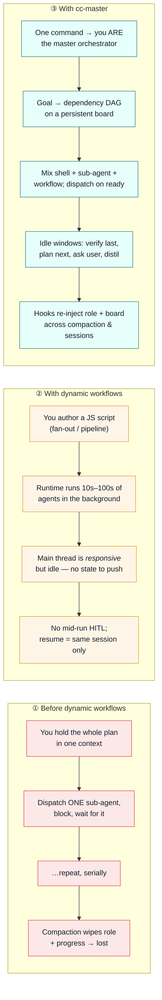

# cc-master

> 中文版见 [README_zh.md](README_zh.md)。

**Hand Claude Code a goal too big for one session — and let it conduct itself to the finish.**

cc-master is a ship-anywhere Claude Code plugin that turns any main-session agent into a long-horizon **master orchestrator**. Point it at work that spans more than a day: it decomposes the goal into a dependency graph, dispatches background work in parallel, keeps the main thread *productively* advancing in every idle window, and — the hard part — survives repeated context compaction and resumes across sessions without forgetting who it is or what's left.

```
/cc-master:as-master-orchestrator <a goal worth >24h of work>
```

That one command bootstraps a persistent board and makes the session the orchestrator. Sixty seconds from clone to running.

---

## The vision (north star)

cc-master **aims to** make a Claude Code agent into a master orchestrator that can:

1. **Drive a goal to full completion** across asynchronous, parallel, multi-threaded work — not halfway, all the way.
2. **Control the *rate* of resource (token) burn** — sensing the quota window (e.g. 5h / 7d) and throttling rather than redlining.
3. **Hold the line between deciding autonomously and pulling in the human** — knowing what to settle itself vs. what must be surfaced to the user (irreversible / outward-facing / direction-setting / final sign-off).
4. **Decompose, manage, update, and re-plan the goal** as it learns.
5. **Maximize execution throughput *under* a sane burn rate** — scheduling and orchestrating parallelism for efficiency without exceeding the budget.
6. **Pick the right model for the job** — by complexity, difficulty, and expected duration.

These are **goals that guide the design, not a claim that all six already ship.** Which capabilities are live today vs. still design-only is tracked separately. The full charter is the single source of truth in [`design_docs/spec.md` §1.0](design_docs/spec.md).

---

## The painful gap it fills

Dynamic workflows (shipped with Opus 4.8) gave Claude Code real parallelism — fan out hundreds of agents from one script. But for a *long-horizon* goal, two gaps remain:

1. The official model only promises the main session stays **responsive** (not blocked). It never promises the orchestrator stays **productive** — self-driving, finding the next move, verifying the last one.
2. Nothing carries your **role and progress across compaction**. One context wipe and the orchestrator forgets it was orchestrating.

cc-master fills exactly that gap. It doesn't replace dynamic workflows — it *wraps* them. The workflow runtime is just one of the three background mechanisms it conducts.

### Three paradigms, side by side

Here is the same long goal — *"migrate 9 domains to a new schema"* — run three ways:



|  | ① Before | ② Dynamic workflows | ③ cc-master |
|---|---|---|---|
| **Parallelism** | One sub-agent at a time | Tens–hundreds of agents | Shell + sub-agent + workflow, mixed |
| **Main thread while waiting** | Blocked, or doing it by hand | Responsive but idle | Proactive: verify · look-ahead · HITL · distil |
| **Survives compaction** | No | No | Yes — role + board re-injected |
| **Cross-session resume** | No | Same-session only | Yes — re-discovered from the board file |
| **Endpoint verification** | Ad hoc | Inside the script | Orchestrator verifies independently |
| **Quota awareness** | No | No | Yes — senses the 5h/7d window, throttles by model tier · WIP · defer |

---

## Install

Two supported ways to run cc-master. Pick by how you work.

### A. `--plugin-dir` — recommended (dev / dogfood)

Point Claude Code straight at a live clone. Edits to the repo take effect on the next session — **no cache, no copy step**. This is how the maintainers run it.

```bash
git clone https://github.com/nemori-ai/cc-master.git
cd cc-master
claude --plugin-dir .          # this session loads the plugin from the live repo
```

`claude --plugin-dir /abs/path/to/cc-master` works from anywhere, so you can dogfood cc-master while inside *another* project.

### B. Marketplace + `enabledPlugins` (team / stable)

Add the marketplace, then enable the plugin in your settings. This is the right choice for sharing one pinned version across a team. **Trade-off:** enabled plugins are copied into Claude Code's plugin cache, so live edits to your clone do **not** take effect — you must `claude plugin update` to pick up changes.

```bash
# add this repo as a marketplace (URL, path, or GitHub repo all work)
claude plugin marketplace add nemori-ai/cc-master
claude plugin install cc-master@cc-master
```

Or enable it declaratively in settings. The `enabledPlugins` value is an **object** keyed by `<plugin>@<marketplace>` (not an array):

```jsonc
// ~/.claude/settings.json
{
  "enabledPlugins": {
    "cc-master@cc-master": true
  }
}
```

> Quick rule: iterating on the plugin → `--plugin-dir` (live). Pinning a version for a team → marketplace + `enabledPlugins` (cached).

Both install paths require **Node 22+** and **bash** — nothing else.

---

## Quickstart

Once loaded, hand it a goal big enough to be worth it (think >24h of work, many independent units):

```
/cc-master:as-master-orchestrator <goal>
```

That one command does three things, deterministically:

1. A hook **bootstraps a board** — a persistent, status-bearing task dependency graph — and injects its exact path plus the "you are the master orchestrator" role.
2. The agent **fills in the goal and the DAG**, anchored on the file that already exists.
3. From there the orchestrator **dispatches background work as dependencies clear** and keeps advancing the main thread until everything is done, verified, or waiting on you.

The full command set:

```
/cc-master:as-master-orchestrator <goal>   # bootstrap a board and become the orchestrator
/cc-master:status                          # render the board summary + validate the narrow waist
/cc-master:stop                            # archive the board and stand down (board is kept, not deleted)
```

---

## Demo

A runnable end-to-end demo lives in [`examples/sample-orchestration/`](examples/sample-orchestration/): [`walkthrough.md`](examples/sample-orchestration/walkthrough.md) traces a full orchestration case study step by step, and [`smoke.sh`](examples/sample-orchestration/smoke.sh) exercises the entire hook chain — run it with `bash examples/sample-orchestration/smoke.sh`.

---

## How it works

The plugin is **commands + 2 skills + hooks + a board file**, and each piece has a distinct lifespan:

```
cc-master/
├── .claude-plugin/
│   ├── plugin.json                     manifest
│   └── marketplace.json                marketplace entry (install path B)
├── commands/
│   ├── as-master-orchestrator.md       bootstrap — become the orchestrator
│   ├── status.md                       summarize board progress / health
│   └── stop.md                         archive / mark the board inactive
├── skills/
│   ├── orchestrating-to-completion/    Skill A — the orchestration method (the soul)
│   └── authoring-workflows/            Skill B — how to write workflow scripts
└── hooks/
    └── scripts/{bootstrap-board, reinject, verify-board}.sh
```

- **Commands** are one-shot ignition — you trigger them; they inject the "I am the master orchestrator" philosophy and operating discipline, and open the board.
- **Skills** are the on-demand deep manuals — Skill A when you run the orchestration loop, Skill B when you write a workflow script.
- **Hooks** are the memory that survives compaction — after a context wipe (or on resume) they re-inject "you are the orchestrator + here is your board" so the role and the to-do list don't get forgotten.

### The three background mechanisms it teaches

cc-master coaches the orchestrator to advance the main thread using three reliably ship-anywhere mechanisms:

1. **Background shell** — long-running commands launched detached, so the main thread keeps moving.
2. **Sub-agent (`run_in_background`)** — an independent, terminal reasoning task, integrated on completion.
3. **Workflow** — dynamic-workflow scripts (fan-out / pipeline / loop) for structured parallel orchestration.

It deliberately does **not** use **agent-teams** or **scheduled routines**: neither is reliably ship-anywhere (one is behind an experimental flag, the other needs a claude.ai account and isn't available on Bedrock/Vertex/Foundry), so they are out of scope by design.

### Bootstrap and completion, guaranteed by hooks

The board never depends on the agent cooperating, and the orchestrator can't quietly quit early:

1. **`UserPromptSubmit`** detects the command's sentinel → deterministically creates an empty board skeleton + injects its exact path and the orchestrator role.
2. **`SessionStart`** (`startup | resume | compact`) re-injects role + board after every compaction and on resume.
3. **`Stop`** runs a pure-bash gate: it reads *this session's* active board (filtered by `owner.session_id`, so concurrent orchestrations never interfere). An empty board, or one with `ready`/`uncertain` work left, **blocks** the stop. When the board looks done, the hook forces a one-time **self-check against the goal** before releasing — and a fuse (5 consecutive blocks) prevents a misjudgment from ever wedging the agent. The hook writes its state to a sidecar file; it never touches the board, which stays the agent's single source of truth.

---

## The board

The board is the orchestrator's **persistent save file** for a long task — a status-bearing task dependency graph. It is both the memory that survives compaction *and* the only window a hook (a shell, blind to agent context) can read. Boards live in a configurable home — `$CC_MASTER_HOME` if set, else `<project>/.claude/cc-master/` — and each orchestration gets its own time-sortable file, so concurrent runs never collide. It is the single source of truth (the built-in `Task*` tools are at most a non-authoritative draft mirror), and it's gitignored.

The board has a **narrow waist**: a small, fixed set of fields the hooks depend on (`owner.session_id`, task `status` values, `active`). Everything else is flexible. Keeping that waist stable is the load-bearing contract between the bash hooks and the agent.

---

## Contributing

The dev loop is one clone and two gates — `./run-tests.sh` (hook tests + content contract) and `claude plugin validate .`. The design invariants (hooks limited to bash + node/JS — ADR-006, stable board waist, two non-overlapping skills, the conductor-never-plays-an-instrument red line, ship-anywhere) are spelled out in [CONTRIBUTING.md](CONTRIBUTING.md). Read it before opening a PR.

---

## Acknowledgements

This plugin stands on the shoulders of the people who mapped this terrain first:

- **[Claude Code](https://code.claude.com/docs/en/workflows) (Anthropic)** — for the dynamic-workflow runtime itself, and for [`/deep-research`](https://claude.com/blog/a-harness-for-every-task-dynamic-workflows-in-claude-code), the bundled reference implementation of the fan-out → adversarial-verify → synthesize paradigm. The harness's own launch-time and runtime validation is what lets Skill B teach a contract instead of shipping a linter.
- **[ray-amjad/claude-code-workflow-creator](https://github.com/ray-amjad/claude-code-workflow-creator)** — the community's de-facto authoring skill. Skill B (`authoring-workflows`) borrows its overall shape: a procedural `SKILL.md` plus `references/{api-reference, patterns}` and `assets/{templates, examples}`.
- **[obra/superpowers](https://github.com/obra/superpowers)** — its `dispatching-parallel-agents` is one of the few places in the ecosystem that argues for *preserving the main agent's context for coordination work* — the seed of cc-master's "don't idle-spin" thesis. We also dogfooded the whole build under the superpowers discipline (brainstorming → plans → TDD → review).
- The community pattern libraries we distilled into Skill B's catalog — [alexop.dev](https://alexop.dev/posts/claude-code-workflows-deterministic-orchestration/), [claudefa.st](https://claudefa.st/blog/guide/development/dynamic-workflows), and Anthropic's [*A harness for every task*](https://claude.com/blog/a-harness-for-every-task-dynamic-workflows-in-claude-code).
- **[barkain/claude-code-workflow-orchestration](https://github.com/barkain/claude-code-workflow-orchestration)** — its *soft-enforcement* nudges ("don't let the main agent do the work by hand") are structurally kin to cc-master's red line that the conductor never plays an instrument.

The research that grounds the design is in [`design_docs/research/`](design_docs/research/), and the full specification is in [`design_docs/spec.md`](design_docs/spec.md).

---

## License

[MIT](LICENSE) © 2026 cc-master contributors
