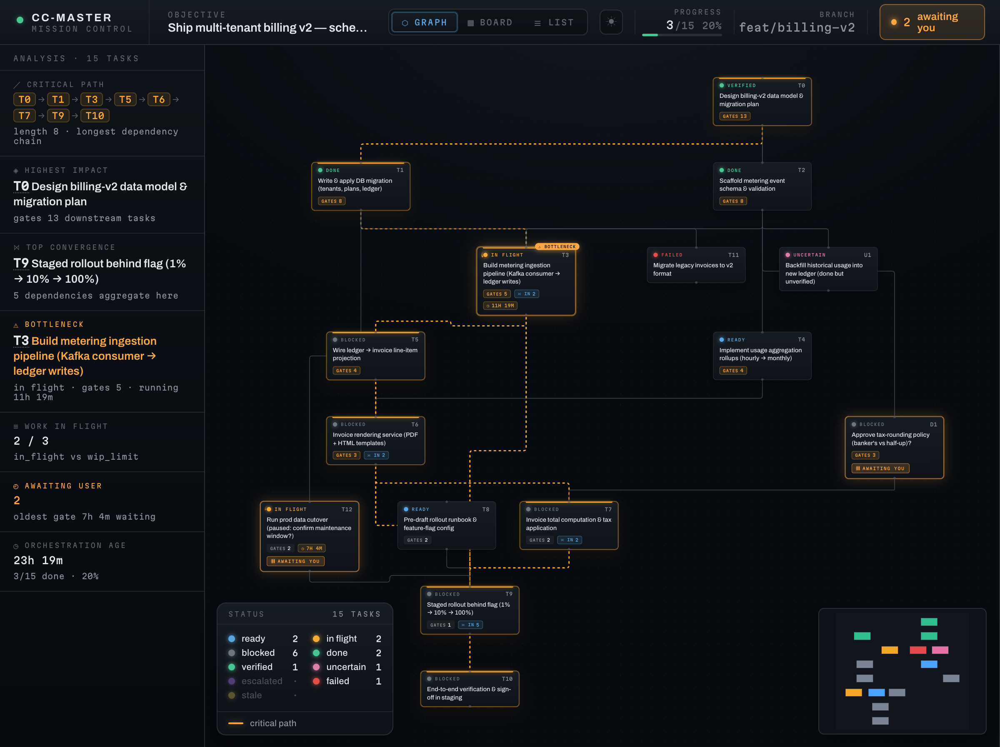

# cc-master

[](https://github.com/nemori-ai/cc-master/releases/tag/v0.17.0)
[](https://github.com/nemori-ai/cc-master/releases/tag/ccm-v0.18.0)
[](design_docs/harnesses/)
[](https://github.com/nemori-ai/cc-master/actions/workflows/ccm-ci.yml)
[](LICENSE)

> 中文见 [README_zh.md](README_zh.md)。

**Give it a big goal — and a budget. Then go do something else.**

cc-master turns a supported coding-agent session into a project lead that never sleeps and actually watches the money. You bring the idea and make the handful of calls that truly need you; it handles the rest — breaking the work down, running it in parallel, tracking progress, keeping spend in check, checking its own work. You come back, and it's done. And it didn't blow your budget.

And there's real machinery behind the warmth: it **runs the numbers thousands of times** to tell you when you'll ship and which step is most likely to slip; it **watches your quota and adjusts its pace** as it goes — easing off when you're tight, pressing when you've got room; and on hosts that support it, it **keeps a few accounts in rotation**, spreading the load and switching before any one runs dry. So it breaks the work into parallel pieces and **delivers it, fast and steady**, all the way to done — no idling, no walls, no wasted spend.

> **You stop being the one who has to watch everything.**

But make no mistake — this is **not** "make a wish and the AI does it all." Taste, design, direction — the calls only you can make **stay yours**; what it takes off your plate is just the breakdown, scheduling, babysitting, and accounting that would otherwise bury you. It even **teaches the AI to stop and ask you when it should** — cc-master's skills are full of philosophy and method for *when to pull the human back in*, handing judgment back to you rather than making the call for you. At bottom it does one thing: in the age of AI-assisted coding, it **reallocates your attention to where it's actually worth spending**.



```
/cc-master:as-master-orchestrator turn my idea into something that works
```

One line, and it's off — then you're free to step away. It works on its own and only comes back when a call is genuinely yours to make.

---

## Is this you?

- **🚀 You have ideas, but you're not an engineer.** You can say what you want — but a thing that takes days and pulls in a dozen threads, you can't babysit it to the finish. What you're missing is a **reliable project lead**. That's what this is.
- **🔧 You're an engineer, but you don't want to be "the manager."** You'd rather solve the hard technical problem than break work down, schedule it, do the accounting, and ride herd on a pile of tasks. **It takes the management off your plate so you can stay in your craft.**
- **🧭 You lead a team.** You want to be ten of yourself. **It carries the drudge-work scheduling; you set direction and make the big calls.**

Three different people, one missing piece: **a mind that can manage the thing to the finish — and do the math.**

---

## What it actually does for you

Hand a big job to a plain AI and you'll find out fast: it loses the plot mid-conversation and **forgets what it was doing**; it can only do one thing at a time and you have to spoon-feed it; it dives in head-first and might **burn your whole month's quota in one go**; and it either pesters you every three sentences or quietly goes off the rails — then tells you it's "basically done" when it isn't.

cc-master takes all of that off your hands, like a project lead who can actually do the math:

- **🧩 Break it down, put a crew on it.** It splits your big goal into ordered steps and runs the ones that can go at once in parallel. And it doesn't split blindly — it works out **which chain decides when the whole thing finishes** (the critical path) and leans on that.
- **🔮 It tells you when you'll finish before it starts.** It runs thousands of simulations and gives you odds — *"50% chance Wednesday, 95% chance Friday"* — and flags which step is most likely to slip. That used to be a project manager with a spreadsheet for an afternoon. Now it's one command, milliseconds.
- **💰 It manages your budget like a CFO.** It knows roughly what each step costs, how long you can keep going, and what pace spends best; when you're close to overspending it slows down — and hands *"do we keep spending?"* back to you to decide. **You won't wake up to a blown budget and a half-finished job.**
- **⚡ It barely ever "stops."** Other AIs hit a usage limit and tell you to *"come back in a few hours."* On Claude Code it can switch to another account in the pool and keep going; on Cursor it paces against your subscription **billing period** instead (no account autoswitch). **Either way, the wall is managed — not ignored.**
- **🧠 It doesn't forget.** Other AIs lose the thread after a long chat; this one remembers who it is, where it got to, and what's left — even across dozens of context resets and several sessions — and **picks up right where it left off.**
- **🙋 It only asks you about the things that matter.** Small calls it makes itself; only when something genuinely needs you does it stop, lay out the context, and wait for your word.
- **🏁 It won't fake being done.** Before it wraps, it checks itself against your original goal, point by point: is every piece actually done? did it ask you everything it should have? did anything quietly die in the background? **If it's not done, it won't pretend it is.**

All you do is the one idea at the start, and the few calls along the way.

---

## Watch it work, start to finish

> You drop one line: **"Translate my app into 6 languages."** Then you go to sleep.

- **It figures out the order first**: the strings have to be pulled out and the framework wired up before any language can be translated. So it does the groundwork, then fans out all 6 languages **at once**.
- **Groundwork gets the better (pricier, steadier) AI; the translations get the cheap one** — saving money without cutting quality. It does the math wherever the math matters.
- Halfway through, **a question only you can answer comes up**: "Product terms — translate them, or keep them in English?" It **notes it for you and moves on**, while every other language keeps going.
- As it runs, **quota gets tight** — it slows the pace, and on Claude Code it can switch to a fuller account; on Cursor it respects the billing-period window. **No silent overspend.**
- **You come back in the morning**: all 6 languages done, every one checked, and your call on the product terms folded in.

Start to finish, you said one sentence and made one decision.

---

## When **not** to use it

A one-or-two-line fix you can knock out in ten minutes? Just do it — don't bring in the "project lead," that's overkill and it'll be slower. **This is built for the kind of goal that's too big for one person to track, takes days, and runs many threads at once.** The bigger, messier, and longer the job, the more it's worth.

---

## What it actually is (for the curious)

cc-master is a **multi-agent-harness plugin system** built from three things: a thin layer of **orchestration logic** (teaching the AI how to be the lead), an **engine** that does operations-research forecasting and pacing, and harness adapters that project that logic into the command, prompt, skill, hook, and settings surfaces each agent host actually supports.

The source follows a paragoge-style `plugin/src -> plugin/dist/<host>` model: shared runtime skills live in canonical source, hooks are modeled as host-independent product contracts with host-native implementations, and each harness gets its own adapter artifact. The plugin version line is shared; release assets are split by harness, for example `cc-master-plugin-claude-code-<version>.zip`, `cc-master-plugin-codex-<version>.zip`, and `cc-master-plugin-cursor-<version>.zip`.

We keep a clear line between "what it does today" and "what we're still building." Current adapters include Claude Code, Codex, and Cursor, with different host surfaces and some different capability levels — for example Claude Code can rotate accounts across 5h/7d windows, while Cursor paces a single subscription billing period and never autoswitches. Board status and the live graph now live on `ccm` (`ccm status-report` / `ccm web-viewer`), not as plugin slash commands. **Every mechanism, and whether each one is shipped or still on the way, is written down honestly in the [Feature Manual](design_docs/feature-manual.md)** — we don't oversell it in the README.

For contributors: edit `plugin/src`, not `plugin/dist`. Skills use SAP (`canonical/` plus `adapters/<host>/strategy.yaml`); hooks use PHIP (`_manifest/`, `_hosts/<host>/`, and `implementations/<host>/`). Regenerate adapters with:

```bash
bash scripts/sync-plugin-dist.sh              # Claude Code adapter
bash scripts/sync-plugin-dist.sh --host codex # Codex adapter
bash scripts/sync-plugin-dist.sh --host cursor # Cursor adapter
```

Before pushing source changes that affect the plugin, install the repo hook once with `bash scripts/install-git-hooks.sh`. It runs `bash scripts/check-plugin-dist-sync.sh` before every push and blocks if `plugin/dist` needs to be regenerated and committed.

Project meta-skills live in `.claude/skills`. Codex discovers repo skills from `.agents/skills`, so keep the Codex projection in sync with:

```bash
bash scripts/sync-codex-skills.sh
```

Harness compatibility notes live in [`design_docs/harnesses/`](design_docs/harnesses/). That directory is the local, corrected source for the paragoge-derived adapter model plus the current Claude Code, Codex, and Cursor facts.

---

## Get started

One command installs both pieces — the `ccm` engine and the cc-master plugin. The two **version independently** ([ADR-022](adrs/ADR-022-version-line-decoupling.md)): the plugin ships under bare `vX.Y.Z` tags, `ccm` under `ccm-vX.Y.Z` tags, on separate release tracks. The installer resolves the latest of each line:

```bash
# install the latest of each line (plugin + ccm)
curl -fsSL https://raw.githubusercontent.com/nemori-ai/cc-master/main/install.sh | bash

# …or pin a specific version of either line — each flag is optional and
# independent; whichever you omit resolves to the latest of that line:
curl -fsSL https://raw.githubusercontent.com/nemori-ai/cc-master/main/install.sh | bash -s -- \
  --ccm-version ccm-v0.18.0 --plugin-version 0.17.0

# pin just one line, leave the other on latest (e.g. hold ccm, take latest plugin):
curl -fsSL https://raw.githubusercontent.com/nemori-ai/cc-master/main/install.sh | bash -s -- --ccm-version ccm-v0.18.0

# target a harness explicitly, or fan out to every installed supported harness:
curl -fsSL https://raw.githubusercontent.com/nemori-ai/cc-master/main/install.sh | bash -s -- --harness claude-code
curl -fsSL https://raw.githubusercontent.com/nemori-ai/cc-master/main/install.sh | bash -s -- --harness cursor
curl -fsSL https://raw.githubusercontent.com/nemori-ai/cc-master/main/install.sh | bash -s -- --all-harnesses
```

It detects your OS and architecture, downloads the right `ccm` binary and puts it on your PATH, then detects installed harnesses and distributes the matching adapter package to each supported target. Before installing either downloaded asset, it fetches that release's `SHA256SUMS` and verifies the asset by exact filename; a missing manifest, missing entry, or digest mismatch stops the install. Claude Code installation uses the `claude` CLI (≥ v2.1.195). Codex installation registers a local Codex marketplace/plugin entry for this local adapter; command entrypoints are exposed as skills (for example `$cc-master-as-master-orchestrator ...`). Cursor installation copies the adapter into `~/.cursor/plugins/local/cc-master` (local plugin surface). You just need `curl` (or `wget`), `unzip`, and a SHA256 tool (`sha256sum`, `shasum`, or `openssl`); each harness adapter may also need that harness's own CLI/config directory to be present. The `ccm` engine is a **hard prerequisite** — without it the plugin won't start an orchestration — which is exactly why the installer puts it in place first.

Checksum failures are treated as release integrity failures, not as prompts to bypass verification. Retry the install; if it still fails, inspect the GitHub release assets before proceeding. `CC_MASTER_INSTALL_LOCAL` remains offline: it verifies `<local-dir>/SHA256SUMS` when present, otherwise it explicitly trusts the local directory without contacting GitHub.

> **Rather do it by hand, or run from source?** Clone the repo, generate the adapter you want with `bash scripts/sync-plugin-dist.sh --host <harness>`, then install that adapter through the harness-native route. Claude Code can point at `plugin/dist/claude-code`; Codex should be registered through a local marketplace that points at `plugin/dist/codex` (with only skill/hooks packaged there); Cursor can copy `plugin/dist/cursor` to `~/.cursor/plugins/local/cc-master`. You'll still need `ccm` on your PATH — download `ccm-<os>-<arch>` from the latest `ccm-v*` release's **Assets**, rename it to `ccm`, `chmod +x`, and drop it in `~/.local/bin`.

**Moved your harness config?** `CLAUDE_CONFIG_DIR` still controls Claude Code's own settings, credentials, and transcript project files; `CODEX_HOME` controls Codex's home. cc-master's runtime state is harness-neutral: boards, account registry, file vault, and quota sidecar live under `${CC_MASTER_HOME:-$HOME/.cc_master}` unless you pass `--home`.

### Cursor install

```bash
curl -fsSL https://raw.githubusercontent.com/nemori-ai/cc-master/main/install.sh | bash -s -- --harness cursor
```

`ccm` is still a hard prerequisite (the installer places it first). The Cursor adapter lands at `~/.cursor/plugins/local/cc-master` — reopen a Cursor Agent session after install so hooks/rules pick up. Cursor pacing uses the dashboard **billing-period** window (not Claude Code's 5h/7d + account switch): under `CC_MASTER_HARNESS=cursor`, `ccm usage advise` reads that signal and may return `hold` / `throttle` / `stop_billing_period` (never `switch`).

### Status line (automatic · Claude Code)

On Claude Code, cc-master ships its own status line — a context progress bar plus your 5h / 7d quota usage, color-coded by how full each is. The **first time you run any `ccm` command, cc-master configures it for you automatically** (it writes `statusLine.command` in your global `settings.json`). The same status line also feeds the 5h / 7d quota signal that powers forecasting and pacing on that host.

Heads-up: this **overwrites your existing `statusLine`** (your original is backed up first). To put yours back: `ccm statusline uninstall` (restores your original and stops cc-master from re-installing). To disable the auto-install entirely, set `CC_MASTER_NO_AUTOINSTALL=1`.

Cursor does **not** use this 5h/7d status line for pacing — it reads the dashboard **billing-period** window via `ccm usage advise` under `CC_MASTER_HARNESS=cursor`.

Now hand it a goal through your harness's entrypoint:

```
# Claude Code
/cc-master:as-master-orchestrator <your goal>

# Codex
$cc-master-as-master-orchestrator <your goal>

# Cursor (Agent chat slash command)
/as-master-orchestrator <your goal>
```

---

## Everyday use

The handful of commands you'll actually type. The in-session entrypoint is harness-specific; `ccm …` always runs in your **terminal**.

- **Start / resume** — Claude Code: `/cc-master:as-master-orchestrator <goal>` or `/cc-master:as-master-orchestrator --resume`; Codex: `$cc-master-as-master-orchestrator <goal>` or `$cc-master-as-master-orchestrator --resume`; Cursor: `/as-master-orchestrator <goal>` or `/as-master-orchestrator --resume` (reopen the Agent session after install so hooks/rules load).
- **Status** — `ccm status-report show`. Generates the shared JSON-backed board status report for CLI and the web viewer.
- **View** — `ccm web-viewer open`. Opens the live plan as a read-only graph in your browser; lifecycle commands are `ccm web-viewer start/open/status/stop/restart`.
- **Discuss** — Claude Code: `/cc-master:discuss <decision>`; Codex: `$cc-master-discuss <decision>`. Use it when a decision is waiting on you.
- **Stop** — Claude Code: `/cc-master:stop`; Codex: `$cc-master-stop`. Wraps up and archives the board; you can resume later.
- **Handoff** — Claude Code: `/cc-master:handoff-to-new-session`; Codex: `$cc-master-handoff-to-new-session`. Use it before moving the run to a fresh session.
- **Retro** — Claude Code: `/cc-master:retro`; Codex: `$cc-master-retro`. Read-only retrospective on an in-progress or archived board — writes a lessons-learned document into the project itself (not the board, not GitHub).
- **Distill** — Claude Code: `/cc-master:distill <retro-path...>`; Codex: `$cc-master-distill <retro-path...>`. Turns a retro's candidate lessons into real project assets (discipline-doc note, skill, workflow, or subagent) — always gated by a single user-approved plan, always collected via a feature-branch PR (or a draft directory for non-git projects). Never touches the board or `ccm`.
- **`ccm account add|list|switch <email>`** — on Claude Code, build and steer a pool of backup accounts so pacing can switch when one window runs low. You run these in your terminal; tokens stay token-blind and never reach the AI's context. Cursor has no account autoswitch — use billing-period pacing instead.

> That's the everyday set. The full command surface (every `ccm` namespace and flag) is in the [command catalog](plugin/src/skills/using-ccm/canonical/references/command-catalog.md); what's shipped vs. still on the way is in the [Feature Manual](design_docs/feature-manual.md).

---

## Go deeper

- **Everything it can do, with honest status** → [Feature Manual](design_docs/feature-manual.md)
- **Contributors / architecture, start here** → [`AGENTS.md`](AGENTS.md)
- **Full design** → [`design_docs/spec.md`](design_docs/spec.md)

---

## Acknowledgements · License

Standing on the shoulders of those who came before: [Claude Code](https://code.claude.com/docs/en/workflows) (Anthropic), [claude-code-workflow-creator](https://github.com/ray-amjad/claude-code-workflow-creator), [superpowers](https://github.com/obra/superpowers), [claude-code-workflow-orchestration](https://github.com/barkain/claude-code-workflow-orchestration).

[MIT](LICENSE) © 2026 cc-master contributors
