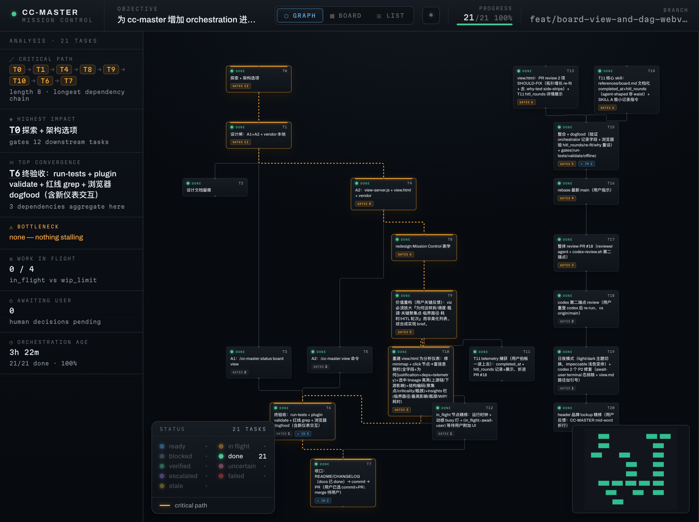

# cc-master

[](https://github.com/nemori-ai/cc-master/releases/tag/v0.17.0)
[](https://github.com/nemori-ai/cc-master/releases/tag/ccm-v0.18.0)
[](design_docs/harnesses/)
[](https://github.com/nemori-ai/cc-master/actions/workflows/ccm-ci.yml)
[](LICENSE)

> For English, see [README.md](README.md)。

**给它一个大目标，和一份预算。然后去忙你自己的。**

它会把一个受支持的 coding agent 会话变成一个不睡觉、还特别会算账的项目负责人，替你把活一路干到验收通过——顺手把你的预算也管了。你只管出主意、在真正的大事上拍个板；剩下的拆解、调度、盯进度、控成本、查验收，它全包了。等你回来，活干完了，而且没花冤枉钱。

它这份「靠谱」背后是真有算法撑着的：它会**推演上千遍**替你算出几号能交付、哪一步最容易拖后腿；一边干一边**盯着你的额度调速**——紧了就稳一稳、有富余就赶一赶；在支持的宿主上，它还能**攥着好几个号轮着用**，把负载摊匀、哪个快空了就换下一个。于是它把活**拆开并行、又快又稳**地一路交付到完成——不空等、不撞墙、不烧冤枉钱。

> **你不用再当那个什么都得盯着的人。**

但别误会——它**不是替你许个愿、AI 就把一切包圆**。品味、设计、方向这些只有你能拍的事，**始终是你的**；它接走的只是会把你淹没的拆解、调度、盯梢、记账。它甚至专门**教 AI 在该问你的时候停下来问你**——cc-master 的 skills 里就有大量「何时该把人请回来」的哲学与方法论，是把判断权**交还**给你、不是替你拍板。说到底它做的就一件事：在 AI 辅助编程的时代，**帮你把注意力重新分配到真正值得你花的地方**。



```
/cc-master:as-master-orchestrator 把我的想法做成能用的东西
```

一句话，它就开工了——然后你尽管去忙别的。它自己干，只有真正该你拍板的事才回来找你。

---

## 这说的是不是你

- **🚀 你有想法，但不是工程师。** 你说得清要什么，可一个要好几天、千头万绪的东西，你没法盯着它一路做完——你缺的是一个**靠谱的项目负责人**。它就是。
- **🔧 你是工程师，但不想当"管事的"。** 你想专心解技术难题，不想去拆活、排工、算账、盯一堆任务还得不停做判断。**它把"管理"接走，你留在你擅长、也喜欢的地方。**
- **🧭 你在带团队。** 你想把自己变成十个自己。**它替你扛下所有琐碎调度，你只管定方向、拍大事。**

三种人，缺的是同一样东西：**一个能替你把事情管到底、还会算账的脑子。**

---

## 它到底替你做了什么

把一个大活交给普通的 AI，你会很快发现：它聊着聊着就**忘了自己在干嘛**；一次只能干一件、你得在旁边一步步喂；闷头一扎进去，可能**把你这个月的额度一口烧光**；要么三句一问烦死你，要么自作主张跑偏，最后还跟你说"差不多做完了"——其实没有。

cc-master 把这些全接管了，像个真正会算账的项目负责人那样：

- **🧩 拆活 + 一队人一起上。** 把大目标拆成有先后的小步，能同时干的就调一队 AI 并行开工。而且它不瞎拆——会算出**哪条链决定整个项目啥时候完**（临界路径），盯着那条使劲。
- **🔮 开工前就告诉你啥时候完。** 它跑几千次模拟，给你一个**概率**："五成把握周三完、九成把握周五完"，还点出哪个环节最可能拖后腿。这本来是项目经理拿 Excel 算半天的活，现在一条命令、几十毫秒。
- **💰 像个 CFO 一样管你的预算。** 它清楚每一步大概烧多少、还能撑多久、按什么节奏花最划算；快超支了它减速、甚至把"要不要继续烧钱"这种决定推回给你拍板——**不会让你一觉醒来发现额度透支、活还没干完。**
- **⚡ 它几乎不会"停机"。** 别的 AI 一撞到用量上限，就甩你一句"过几小时再来"。在 Claude Code 上它可以从号池切到另一个账号接着干；在 Cursor 上它按订阅的 **billing period** 账单周期配速（不会自动换号）。**墙是被管住的，不是被无视的。**
- **🧠 它不会忘。** 别的 AI 聊久了会"断片"；它哪怕上下文被压缩几十次、跨了好几个会话，每次醒来都记得自己是谁、做到哪了、还剩什么，**从断点接着干，不回到原点。**
- **🙋 只在真正重要的事上问你。** 小决定它自己拿主意；只有"这事得你拍板"的，它才停下来、把来龙去脉讲清楚、等你一句话。
- **🏁 它不会假装做完。** 完工前它自己回头对着你最初的目标逐条自检：每件事真做完了吗？该问你的都问了吗？后台有没有悄悄挂掉的？**没做完，它不会糊弄你说做完了。**

你做的，只有开头那一个主意、和中途那几次拍板。

---

## 看它干一次，从头到尾

> 你扔下一句：**"把我的 app 翻译成 6 种语言。"** 然后去睡觉。

- **它先想清楚顺序**：得先把要翻的词抽出来、搭好框架，6 种语言才能各翻各的。于是它先干打底的活，再把 6 种语言**同时**派出去。
- **打底的活用好一点的 AI（贵但稳），翻译的活用便宜的 AI**——省钱又不耽误质量，该精打细算的地方它都算过。
- 翻到一半，**冒出一个只有你能定的问题**："产品里的专有名词，翻译还是保留英文？" 它**立刻记下来等你**，同时手上别的语言一刻没停。
- 干着干着**额度快到上限**了，它放慢节奏；在 Claude Code 上还能换个更满的账号，在 Cursor 上则守住账单周期窗口——**不会默默超支**。
- **第二天早上你回来**：6 种语言全好了，每一处它都自己核对过，你那个专有名词的决定也落实进去了。

从头到尾，你只说了一句话、拍了一个板。

---

## 什么时候**别**用它

一个改一两行、十分钟搞定的小活——直接干就好，别请这个"项目负责人"，那是杀鸡用牛刀、反而更慢。**它是为那种"大到你一个人盯不过来、要好几天、要同时推很多条线"的目标准备的。** 活越大、越乱、越久，它越值。

---

## 它其实是个什么（给好奇的人）

cc-master 是一套**多 agent harness 兼容的插件系统**，背后是三样东西搭起来的：一层薄薄的**指挥逻辑**（教 AI 怎么当总指挥）、一个能做**运筹学估算和配速**的引擎、以及把这些能力投射到不同 agent host 命令、prompt、skill、hook、settings 表面的 harness adapter。

源码采用 paragoge 式 `plugin/src -> plugin/dist/<host>` 模型：共享 runtime skills 放在 canonical 源里，hooks 先建 host 无关的产品契约、再落各 host 的原生实现，每个 harness 都生成自己的 adapter 产物。插件版本线是一条；release asset 按 harness 拆分，例如 `cc-master-plugin-claude-code-<version>.zip`、`cc-master-plugin-codex-<version>.zip` 和 `cc-master-plugin-cursor-<version>.zip`。

我们对"做到了什么"和"还在做什么"分得很清楚。当前 adapter 包含 Claude Code、Codex 和 Cursor；不同 host 的表面和能力层级不完全相同——例如 Claude Code 可以在 5h/7d 窗口间轮换账号，Cursor 则按单一订阅账单周期配速、不会自动换号。board 状态与实时图现在落在 `ccm` 上（`ccm status-report` / `ccm web-viewer`），不再是插件 slash command。**全部机制、以及每一项到底是已落地还是还在路上，都诚实写在 [产品功能手册](design_docs/feature-manual.md) 里**，不在 README 里夸大。

给贡献者：改 `plugin/src`，不要手改 `plugin/dist`。Skills 走 SAP（`canonical/` + `adapters/<host>/strategy.yaml`）；hooks 走 PHIP（`_manifest/`、`_hosts/<host>/`、`implementations/<host>`）。重新生成 adapter：

```bash
bash scripts/sync-plugin-dist.sh              # Claude Code adapter
bash scripts/sync-plugin-dist.sh --host codex # Codex adapter
bash scripts/sync-plugin-dist.sh --host cursor # Cursor adapter
```

任何影响 plugin 的源码改动，push 前都要确保生成物一起提交。每个 clone 先跑一次 `bash scripts/install-git-hooks.sh`；它会安装本仓 pre-push hook，每次 push 前自动跑 `bash scripts/check-plugin-dist-sync.sh`，如果 `plugin/dist` 需要重新生成并提交，就阻止 push。

项目 meta-skills 放在 `.claude/skills`。Codex 项目级 skills 从 `.agents/skills` 发现，所以改完 meta-skills 后同步一次：

```bash
bash scripts/sync-codex-skills.sh
```

harness 兼容资料放在 [`design_docs/harnesses/`](design_docs/harnesses/)。那里是本仓校对后的本地资料源：包含从 paragoge 迁移来的 adapter 模型，也包含当前 Claude Code / Codex / Cursor 的真实机制结论。

---

## 上手

一条命令，把两样东西——`ccm` 引擎和 cc-master 插件——装好。两者**各自独立版本**（[ADR-022](adrs/ADR-022-version-line-decoupling.md)）：插件走裸 `vX.Y.Z` tag，`ccm` 走 `ccm-vX.Y.Z` tag，各自独立的发版线。安装器各取各线的最新版：

```bash
# 各取两条线（插件 + ccm）的最新版
curl -fsSL https://raw.githubusercontent.com/nemori-ai/cc-master/main/install.sh | bash

# …或分别 pin 某条线的版本——两个 flag 各自可选、各自独立，
# 省掉哪个、哪个就解析为本线最新：
curl -fsSL https://raw.githubusercontent.com/nemori-ai/cc-master/main/install.sh | bash -s -- \
  --ccm-version ccm-v0.18.0 --plugin-version 0.17.0

# 只 pin 一条线、另一条留最新（例如锁住 ccm、插件取最新）：
curl -fsSL https://raw.githubusercontent.com/nemori-ai/cc-master/main/install.sh | bash -s -- --ccm-version ccm-v0.18.0

# 显式指定 harness，或分发到本机所有已安装且支持的 harness：
curl -fsSL https://raw.githubusercontent.com/nemori-ai/cc-master/main/install.sh | bash -s -- --harness claude-code
curl -fsSL https://raw.githubusercontent.com/nemori-ai/cc-master/main/install.sh | bash -s -- --harness cursor
curl -fsSL https://raw.githubusercontent.com/nemori-ai/cc-master/main/install.sh | bash -s -- --all-harnesses
```

它会探测你的操作系统和架构，下对应的 `ccm` 二进制、放进 PATH，再识别本机已安装的 harness，并把对应 adapter 包分发到每个受支持目标。每个联网下载的 release asset 在安装前都会先下载同一 release 的 `SHA256SUMS`，按精确文件名校验；清单缺失、条目缺失或 digest 不匹配都会停止安装。Claude Code 安装走 `claude` CLI（≥ v2.1.195）。Codex 安装会注册本地 Codex marketplace/plugin，命令入口走插件分发的 `$cc-master-*` 技能（如 `$cc-master-as-master-orchestrator ...`）。Cursor 安装会把 adapter 复制到 `~/.cursor/plugins/local/cc-master`（local plugin 面）。你只需本机已有 `curl`（或 `wget`）、`unzip` 和一个 SHA256 工具（`sha256sum` / `shasum` / `openssl`）；每个 harness adapter 还可能需要对应 harness 的 CLI 或 config 目录已经存在。`ccm` 引擎是**硬前置**——没有它插件就不会开工——所以安装器先把它就位。

checksum 失败按 release 完整性失败处理，不提供绕过安装。请重试；若仍失败，先检查 GitHub release assets 再继续。`CC_MASTER_INSTALL_LOCAL` 仍保持离线路径：本地目录有 `SHA256SUMS` 就校验，没有则明确改为信任该本地目录，不联网取清单。

> **想自己手动装，或从源码跑？** clone 本仓，先用 `bash scripts/sync-plugin-dist.sh --host <harness>` 生成你要的 adapter，再走对应 harness 的原生安装路径。Claude Code 可以指向 `plugin/dist/claude-code`；Codex 应通过一个本地 marketplace 注册 `plugin/dist/codex`（命令入口为 `$cc-master-*`）；Cursor 可以把 `plugin/dist/cursor` 复制到 `~/.cursor/plugins/local/cc-master`。你仍需一个 `ccm` 在 PATH 上——从最新 `ccm-v*` release 的 **Assets** 下 `ccm-<os>-<arch>`、重命名为 `ccm`、`chmod +x`、放进 `~/.local/bin`。

**把 harness config 挪走了？** `CLAUDE_CONFIG_DIR` 仍只控制 Claude Code 自己的 settings、credentials 和 transcript projects；`CODEX_HOME` 控制 Codex home。cc-master 的运行时状态是 harness-neutral 的：board、号池 registry、file vault、配额 sidecar 默认落在 `${CC_MASTER_HOME:-$HOME/.cc_master}`，除非你显式传 `--home`。

### Cursor 安装

```bash
curl -fsSL https://raw.githubusercontent.com/nemori-ai/cc-master/main/install.sh | bash -s -- --harness cursor
```

`ccm` 仍是硬前置（安装器会先装好它）。Cursor adapter 落在 `~/.cursor/plugins/local/cc-master`——装完后请重开 Cursor Agent session，让 hooks/rules 生效。Cursor 配速走 dashboard 的 **billing_period** 账单周期窗口（不是 Claude Code 的 5h/7d + 换号）：在 `CC_MASTER_HARNESS=cursor` 下，`ccm usage advise` 读该信号，可能返回 `hold` / `throttle` / `stop_billing_period`（不会返回 `switch`）。

### 状态栏（自动 · Claude Code）

在 Claude Code 上，cc-master 自带一条状态栏——context 进度条 + 你的 5h / 7d 配额用量，按各自用得多满**变色**。**你第一次跑任意 `ccm` 命令时，cc-master 会自动帮你配好它**（在你的全局 `settings.json` 写入 `statusLine.command`）。这条状态栏同时把 5h / 7d 配额信号喂给该宿主上的预测与配速。

提示：它**会覆盖你现有的 `statusLine`**（已先备份你原来的）。想还原你自己的：`ccm statusline uninstall`（恢复原值，并让 cc-master 不再覆盖回去）。想彻底关掉自动安装：设 `CC_MASTER_NO_AUTOINSTALL=1`。

Cursor **不用**这条 5h/7d 状态栏做配速——它在 `CC_MASTER_HARNESS=cursor` 下通过 `ccm usage advise` 读 dashboard 的 **billing_period** 账单周期。

然后通过你的 harness 入口给它一个目标：

```
# Claude Code
/cc-master:as-master-orchestrator <你的目标>

# Codex
$cc-master-as-master-orchestrator <你的目标>

# Cursor（Agent 会话 slash command）
/as-master-orchestrator <你的目标>
```

---

## 日常使用

你真正会敲的就这几条命令。会话内入口按 harness 不同而不同；`ccm …` 一律在你的**终端**里敲。

- **Start / resume** — Claude Code：`/cc-master:as-master-orchestrator <目标>` 或 `/cc-master:as-master-orchestrator --resume`；Codex：`$cc-master-as-master-orchestrator <目标>` 或 `$cc-master-as-master-orchestrator --resume`；Cursor：`/as-master-orchestrator <目标>` 或 `/as-master-orchestrator --resume`（装完后请重开 Agent session，让 hooks/rules 生效）。
- **Status** — `ccm status-report show`。生成 CLI 和 web viewer 共用的 JSON-backed board 状态报告。
- **View** — `ccm web-viewer open`。在浏览器里把实时计划打开成只读图；生命周期命令是 `ccm web-viewer start/open/status/stop/restart`。
- **Discuss** — Claude Code：`/cc-master:discuss <决定>`；Codex：`$cc-master-discuss <决定>`。当有决定等你拍板时使用。
- **Stop** — Claude Code：`/cc-master:stop`；Codex：`$cc-master-stop`。收尾并归档 board，以后可以继续 resume。
- **Handoff** — Claude Code：`/cc-master:handoff-to-new-session`；Codex：`$cc-master-handoff-to-new-session`。在换新会话前交接。
- **Retro** — Claude Code：`/cc-master:retro`；Codex：`$cc-master-retro`。对进行中或已归档的 board 做一次只读复盘，把经验写进被编排项目自己（不写 board、不碰 GitHub）。
- **Distill** — Claude Code：`/cc-master:distill <retro-path...>`；Codex：`$cc-master-distill <retro-path...>`。把一份复盘文档里的候选经验蒸馏成目标项目的实际资产（纪律文档一句指针 / skill / workflow / subagent）——一律经用户批准的蒸馏计划把关，一律走 feature-branch PR 收口（非 git 项目降级为变更草稿目录）。绝不碰 board、不调用 `ccm`。
- **`ccm account add|list|switch <email>`** — 在 Claude Code 上建备用账号池并调度，好让配速在某个窗口用紧时切号。这几条你在终端里敲；token 全程 token-blind，绝不进 AI 的 context。Cursor 没有自动换号——改走 billing_period 配速。

> 日常就这一组。完整命令面（每个 `ccm` namespace 和 flag）在 [命令目录](plugin/src/skills/using-ccm/canonical/references/command-catalog.md)；哪些已落地、哪些还在路上，在 [产品功能手册](design_docs/feature-manual.md)。

---

## 想更深入

- **它能做的每一件事 + 诚实状态** → [产品功能手册](design_docs/feature-manual.md)
- **贡献者 / 架构第一站** → [`AGENTS.md`](AGENTS.md)
- **完整设计** → [`design_docs/spec.md`](design_docs/spec.md)

---

## 致谢 · 许可证

站在先行者的肩膀上：[Claude Code](https://code.claude.com/docs/en/workflows)（Anthropic）、[claude-code-workflow-creator](https://github.com/ray-amjad/claude-code-workflow-creator)、[superpowers](https://github.com/obra/superpowers)、[claude-code-workflow-orchestration](https://github.com/barkain/claude-code-workflow-orchestration)。

[MIT](LICENSE) © 2026 cc-master contributors
