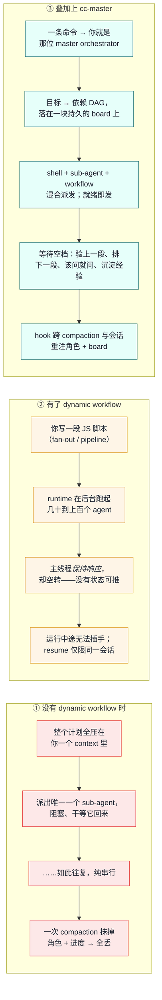

# cc-master

> For English, see [README.md](README.md)。

**把一个单会话装不下的大目标交给 Claude Code —— 让它自己指挥自己干到收尾。**

cc-master 是一个「随处可用」（ship-anywhere）的 Claude Code 插件，把任意 main-session agent 一键变成长周期的 **master orchestrator（总指挥）**。把跨度超过一天的活交给它：它会把目标拆成依赖图、把后台工作并行派发出去，在每一个等待空档里让主线程**有产出地**持续推进——而最难的那一点是：它能熬过反复的 context compaction、跨会话续上，全程不忘自己是谁、还剩什么没干。

```
/cc-master:as-master-orchestrator <一个值得花 >24h 的目标>
```

这一条命令就会 bootstrap 一块持久的 board，并把当前 session 化身为总指挥。从 clone 到跑起来，60 秒。

---

## 它填的那块「痛点空白」

Dynamic workflows（随 Opus 4.8 一同发布）给了 Claude Code 真正的并行能力——一段脚本就能 fan out 出上百个 agent。但对一个**长周期**目标来说，仍有两处空白：

1. 官方模型只承诺主会话**保持响应**（不被阻塞），从不承诺总指挥**保持产出**——自驱找活、找到下一步、验上一步。
2. 没有任何机制能把你的**角色与进度带过一次 compaction**。上下文一被抹掉，总指挥就忘了自己正在指挥。

cc-master 填的正是这块空白。它不是要取代 dynamic workflow——而是把它**包了进来**：workflow runtime 只是它指挥的三种后台手段之一。

### 三种范式，并排一看便知

下面是同一个长目标——*「把 9 个 domain 迁移到新 schema」*——三种跑法的对照：



|  | ① 之前 | ② Dynamic workflows | ③ cc-master |
|---|---|---|---|
| **并行度** | 一次一个 sub-agent | 几十到上百个 agent | shell + sub-agent + workflow 混合 |
| **等待时的主线程** | 阻塞，或亲自上手 | 响应但空转 | 主观能动：验收 · 前瞻 · HITL · 沉淀 |
| **能否熬过 compaction** | 否 | 否 | 能——角色 + board 被重注 |
| **跨会话续接** | 否 | 仅限同一会话 | 能——靠 board 文件重新认回 |
| **端点验收** | 临时随手 | 写在脚本里 | 总指挥独立验收 |

---

## 安装

有两种受支持的跑法，按你的工作方式选。

### A. `--plugin-dir` —— 推荐（dev / dogfood）

让 Claude Code 直接指向一个 live 的 clone。对仓库的改动会在下一个 session 即时生效——**没有 cache、不用拷贝**。维护者本人就是这么跑的。

```bash
git clone https://github.com/nemori-ai/cc-master.git
cd cc-master
claude --plugin-dir .          # 本 session 从 live 仓库加载插件
```

`claude --plugin-dir /abs/path/to/cc-master` 在任何地方都能用，所以你可以在**另一个**项目里 dogfood cc-master。

### B. Marketplace + `enabledPlugins`（team / 稳定版）

先把这个仓库加为 marketplace，再在 settings 里启用插件。要在团队里共享同一个固定版本时，这是对的选择。**取舍：** enabled 的插件会被拷进 Claude Code 的 plugin cache，所以对你 clone 的 live 改动**不**会生效——想吃到改动必须 `claude plugin update`。

```bash
# 把本仓库加为 marketplace（URL、本地路径、GitHub repo 三种来源都行）
claude plugin marketplace add nemori-ai/cc-master
claude plugin install cc-master@cc-master
```

或者在 settings 里声明式启用。`enabledPlugins` 的值是一个以 `<plugin>@<marketplace>` 为键的**对象**（不是数组）：

```jsonc
// ~/.claude/settings.json
{
  "enabledPlugins": {
    "cc-master@cc-master": true
  }
}
```

> 一句话判断：在迭代插件本身 → `--plugin-dir`（live）。给团队钉一个版本 → marketplace + `enabledPlugins`（cached）。

两条安装路径都只需 **Node 22+** 与 **bash**，别无他求。

---

## Quickstart

加载后，给它一个值得它出手的目标（量级上 >24h、含许多可独立推进的单元）：

```
/cc-master:as-master-orchestrator <目标>
```

这一条命令确定性地做三件事：

1. 一个 hook **bootstrap 一块 board**——一张持久的、带状态的任务依赖图——并把其确切路径连同「你是 master orchestrator」的角色一起注入进来。
2. agent **填上 goal 与 DAG**，锚定在一个已经存在的文件上。
3. 此后总指挥**依赖一满足就把后台活派出去**，并持续推进主线程，直到万事皆「已完成 / 已验收 / 在等你拍板」。

完整命令集：

```
/cc-master:as-master-orchestrator <目标>   # bootstrap 一块 board，并就此化身总指挥
/cc-master:status                          # 渲染 board 摘要 + 校验「窄腰」契约
/cc-master:stop                            # 归档 board 并收尾（board 保留，不删除）
```

---

## Demo

端到端走查与可直接跑的示例目标即将放进 [`examples/`](examples/)。_（占位——待补。）_

---

## 工作原理

这个插件 = **命令 + 2 个 skill + hooks + 一份 board 文件**，每件各有各的寿命：

```
cc-master/
├── .claude-plugin/
│   ├── plugin.json                     清单（manifest）
│   └── marketplace.json                marketplace 条目（安装方案 B）
├── commands/
│   ├── as-master-orchestrator.md       bootstrap —— 化身总指挥
│   ├── status.md                       汇总 board 进度 / 健康度
│   └── stop.md                         归档 / 置 board 非活跃
├── skills/
│   ├── orchestrating-to-completion/    Skill A —— 编排方法论（魂在这）
│   └── authoring-workflows/            Skill B —— 怎么写 workflow 脚本
└── hooks/
    └── scripts/{bootstrap-board, reinject, verify-board}.sh
```

- **命令**是一次性开机引导——你主动触发，它把「我是 master orchestrator」的哲学与操作纪律灌进来，并开好 board。
- **skill** 是按需调阅的深度手册——跑编排循环时翻 Skill A，写 workflow 脚本时翻 Skill B。
- **hook** 是熬过 compaction 的「记忆续命」——上下文被压缩后（或 resume 时），自动把「你是总指挥 + 这是你的 board」重注回来，让角色与待办不因健忘而失守。

### 它教的三种后台手段

cc-master 教总指挥用三种「随处可用」的可靠手段来推进主线程：

1. **后台 shell** —— 长跑命令以 detached 方式启动，主线程照常前进。
2. **Sub-agent（`run_in_background`）** —— 一个独立、终结性的推理任务，完成后整合回来。
3. **Workflow** —— dynamic-workflow 脚本（fan-out / pipeline / loop），做结构化的并行编排。

它**有意不用** **agent-teams** 和 **scheduled routines**：两者都不够「随处可用」（前者藏在实验开关后面，后者需要 claude.ai 账户、且在 Bedrock/Vertex/Foundry 上不可用），因此被设计性地排除在外。

### Bootstrap 与收尾，由 hook 担保

board 是否存在，**不依赖 agent 听不听话**；总指挥也无法偷偷提前撂挑子：

1. **`UserPromptSubmit`** 检测到命令体里的 sentinel → 确定性地建好一个空 board 骨架 + 把其确切路径和总指挥角色注入进来。
2. **`SessionStart`**（`startup | resume | compact`）在每次 compaction 后、以及 resume 时重注角色 + board。
3. **`Stop`** 跑一道纯 bash 的门：它只读**本 session** 的 active board（按 `owner.session_id` 过滤，所以并发编排互不干扰）。board 为空、或还剩 `ready`/`uncertain` 的活，就 **block** 住这次 Stop。当 board 看起来完成了，hook 会逼 agent 先对照 goal 做一次性的**自检**才放行——还有一道 fuse（连续 block 5 次）兜底，防止误判把 agent 永久焊死。hook 把自己的状态写进一份 sidecar 文件，**绝不碰 board**——board 始终是 agent 的单一真理源。

---

## 那块 board

board 是总指挥为一个长任务存的**存档文件**——一张带状态的任务依赖图。它既是熬过 compaction 的记忆，又是 hook（一个 shell，读不到 agent context）唯一能读到的编排状态窗口。board 落在可配置的 home 里——设了 `$CC_MASTER_HOME` 就用它，否则用 `<project>/.claude/cc-master/`——且每次编排各得一份可按时间排序的独立文件，并发跑也互不冲突。它是**单一真理源**（内建的 `Task*` 工具顶多算一份非权威的草稿镜像），并已被 gitignore。

board 有一条**窄腰**：那一小撮 hook 依赖的固定字段（`owner.session_id`、task 的 `status` 值、`active`）。其余皆为 flexible。让这条窄腰保持稳定，是 bash hook 与 agent 之间那条命根子的契约。

---

## 贡献

开发闭环 = 一次 clone + 两道门——`./run-tests.sh`（hook 测试 + 内容契约）与 `claude plugin validate .`。设计不变量（纯 bash hook、稳定的 board 窄腰、两个不重叠的 skill、「指挥绝不演奏乐器」红线、ship-anywhere）都写在 [CONTRIBUTING.md](CONTRIBUTING.md) 里。提 PR 前先读它。

---

## 致谢

这个插件是站在先行者的肩膀上的：

- **[Claude Code](https://code.claude.com/docs/en/workflows)（Anthropic）** —— 感谢 dynamic-workflow runtime 本身，以及 [`/deep-research`](https://claude.com/blog/a-harness-for-every-task-dynamic-workflows-in-claude-code)——它是 fan-out → 对抗验证 → 综合 这一范式的官方样板实现。正是 harness 自带的 launch 期与 runtime 期校验，才让 Skill B 得以「教契约」而非「再造一个 linter」。
- **[ray-amjad/claude-code-workflow-creator](https://github.com/ray-amjad/claude-code-workflow-creator)** —— 社区事实标准的 authoring skill。Skill B（`authoring-workflows`）的整体骨架借鉴了它：一份程序化的 `SKILL.md`，外加 `references/{api-reference, patterns}` 与 `assets/{templates, examples}`。
- **[obra/superpowers](https://github.com/obra/superpowers)** —— 它的 `dispatching-parallel-agents` 是生态里少有的、明确主张「把主 agent 的 context 留给协调工作」之处——正是 cc-master「主线程不空转」论点的种子。整个开发也是在 superpowers 的纪律下 dogfood 出来的（brainstorming → 写 plan → TDD → review）。
- 我们提炼进 Skill B 范式库的那些社区文章—— [alexop.dev](https://alexop.dev/posts/claude-code-workflows-deterministic-orchestration/)、[claudefa.st](https://claudefa.st/blog/guide/development/dynamic-workflows)，以及 Anthropic 的 [*A harness for every task*](https://claude.com/blog/a-harness-for-every-task-dynamic-workflows-in-claude-code)。
- **[barkain/claude-code-workflow-orchestration](https://github.com/barkain/claude-code-workflow-orchestration)** —— 它的「软约束」轻推（soft enforcement，「别让主 agent 亲自上手干活」）与 cc-master「指挥绝不演奏乐器」的红线在结构上同根同源。

支撑本设计的研究都在 [`design_docs/research/`](design_docs/research/)，完整设计 spec 在 [`design_docs/spec.md`](design_docs/spec.md)。

---

## 许可证

[MIT](LICENSE) © 2026 cc-master contributors
