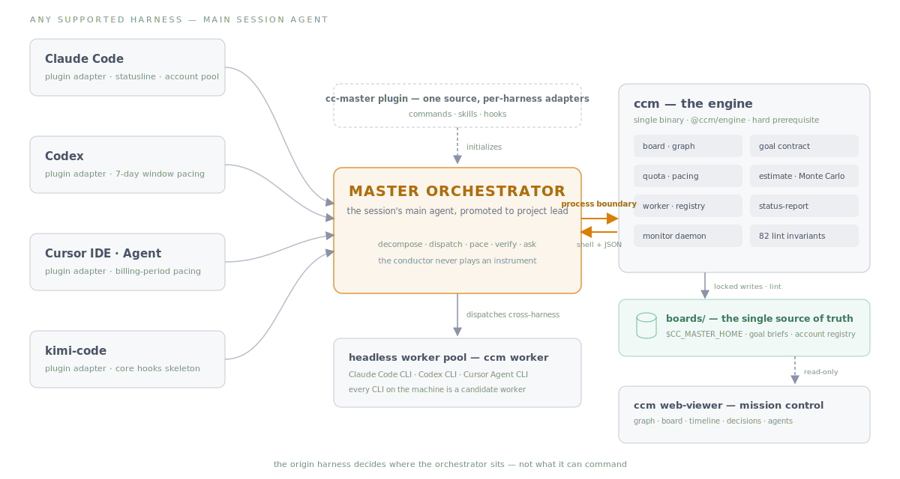
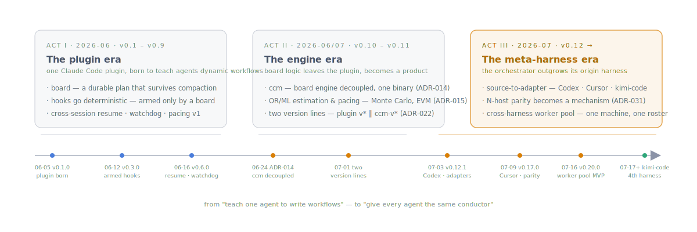
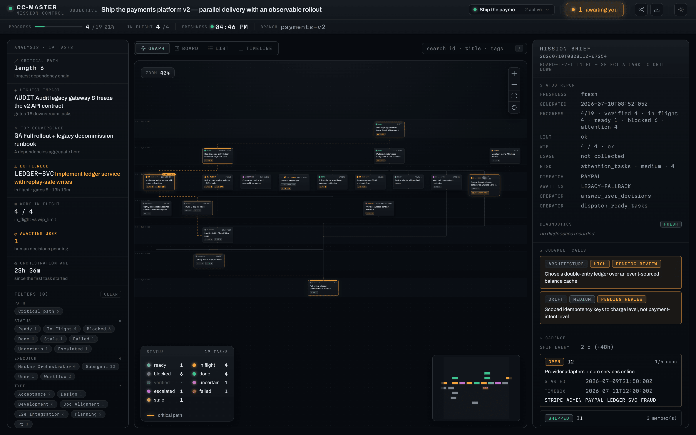
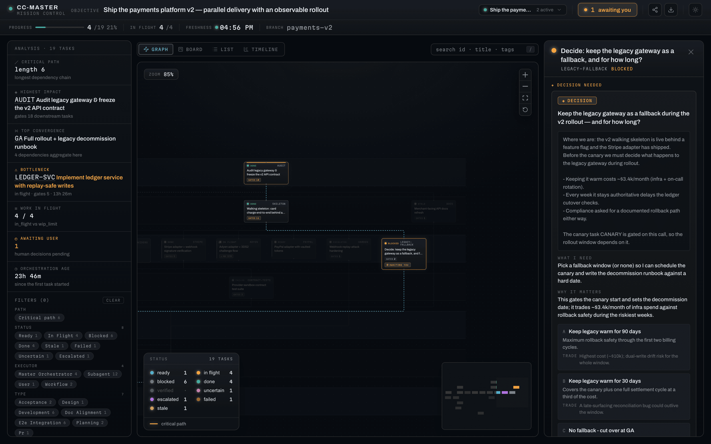

# cc-master

[](https://github.com/nemori-ai/cc-master/releases/tag/v0.20.1)
[](https://github.com/nemori-ai/cc-master/releases/tag/ccm-v0.21.0)
[](design_docs/harnesses/)
[](https://github.com/nemori-ai/cc-master/actions/workflows/ccm-ci.yml)
[](LICENSE)

> English: [README.md](README.md) · 官网：[cc-master.vibecoding.icu](https://cc-master.vibecoding.icu)

**给它一个大目标——和一个预算。然后去做点别的。**

cc-master 把任意受支持的 coding-agent 会话的主 agent 初始化成 **master orchestrator**——一个长程任务的项目负责人：把目标拆成依赖图，让彼此独立的部分并行推进，按真实配额限制调节节奏，把计划记成一份扛得住 context 重置与会话交接的持久档案，并且清楚地知道什么时候该停下来问你。你出想法，并只做那些真正非你不可的判断。

**这说的是不是你？** 有想法但不是工程师——一个要跑好几天的活，你没法全程盯着它到终点。或者你是工程师，但不想当"项目经理"——拆解、排期、记账、盯进度，你想交出去，专心解难题。或者你带团队，想有十个自己。三种人，缺的是同一块拼图：**一个能把事情管理到终点、还会算账的脑子。**

```
/cc-master:as-master-orchestrator 把我的想法变成能跑的东西
```

一句话，立起一份持久的计划。orchestrator 能让多个 worker 同时推进，并且只在判断权真的归你时，带着决策包回来找你。

---

## 一个总指挥，一个引擎，任意 harness



cc-master 支持 **Claude Code、Codex、Cursor、kimi-code**——同一个灵魂，投影进每个 harness。它由三件东西组成：

- **cc-master plugin** 是一层薄投影——commands、skills、hooks——把会话的主 agent 初始化成 orchestrator 角色。单一语义源投影成各 harness 的 adapter，adapter 里只放真正的宿主差异。
- **`ccm` 是引擎**：独立安装的 CLI（外加 `@ccm/engine` 库），掌管 board、Goal Contract、配额姿态、蒙特卡洛估算、跨 harness worker 池和 agent 注册表。plugin 经**进程边界**访问它——shell + JSON，绝不 import——这正是各 harness 一律平等的原因。
- **`ccm web-viewer`** 是机器上所有 board 的只读指挥台：依赖图、临界路径、等你的决策、在飞的 agent。

结论是：orchestrator 的出身 harness 只决定它**坐在哪**——不决定它**能指挥谁**。整台机器、机器上每个 agent CLI，都是它的 worker 池。

---

## 一种新的人 ↔ agent 交互范式

cc-master 也是对「人和 coding agent 该如何分配注意力与判断权」的一次探索。

- **注意力再分配。** 不存在中性的注入——agent context 里的每个 token 都在塑造下一个 token。所以系统发给 agent 的每条消息都按两个轴打标：*决策归谁*、*该拉动多少注意力*：`<ambient>` 背景、`<advisory>` 带强度的建议、`<directive>` 自带 *why* 的闸门。绝大多数通信落在 advisory；directive 被刻意保持稀有。
- **判断权是分层的。** 品味、方向、不可逆的决定——只有你能拍的板始终归你。当某个决策真的非你莫属，它会以**决策包**的形式到来：上下文、选项、各自代价、新鲜度校验——让你在自己方便的时候，对着准确且未过期的完整依据，一次做出高质量决策。
- **可解释性内建于构造。** board 既是计划、记忆，也是审计轨迹——任何一个新 session 拿起它就能续跑；viewer 以只读方式呈现全貌；高杠杆判断由一个*不同族系*的模型独立验收；收尾必须逐条路径写出证据——"看起来做完了"不能关掉一场编排。

目标不是"许个愿，AI 全包"。而是：**你的注意力，只花在真正值得花的地方。**

---

## 演进：从一个 workflow 插件，到 meta-harness



- **第一幕 · 插件期** *（2026-06 · v0.1–v0.9）*。cc-master 起点是一个教 Claude Code agent 写好 dynamic workflow 的插件。沉淀下来的发明：作为持久计划的 **board**、**武装后才激活**的 hooks、跨 session 续跑、最早的配速。
- **第二幕 · 引擎期** *（2026-06/07 · v0.10–v0.11）*。board 逻辑离开插件，成为 **`ccm`**——一个二进制、单一真相源——随后长出 OR/ML 估算与配速引擎：蒙特卡洛交付预测、EVM、conformal 校准，全部手写、零新依赖。plugin 与引擎从此走**两条独立版本线**。
- **第三幕 · meta-harness 期** *（2026-07 · v0.12 →）*。source-to-adapter 架构把同一个灵魂投影进 **Codex、Cursor、kimi-code**，N-host 能力对齐从承诺升级为机制。有了 `ccm worker`，orchestrator 能发现、拉起、观察本机的 Claude Code、Codex、Cursor Agent 无头 CLI——整台机器变成 worker 池。对我们而言，cc-master 已经成为**自研 harness 的 meta-harness**。

---

## 它到底替你做什么

把大活直接扔给裸 AI，你很快就会发现：聊着聊着忘了自己在干嘛；一次只能干一件事，要你一勺一勺喂；闷头猛跑，一个下午能把你的配额窗口烧穿；要么三句话一请示，要么自作主张跑飞——最后告诉你"差不多做完了"，其实没有。cc-master 把这一切接过来：

- **🧩 拆解目标，放上并行产线。** 目标先落成 Goal Contract，再拆成依赖图；能并行的立刻并行。它还会算出**哪条链决定整体完工时间**（临界路径），把资源压上去。
- **🌐 把整台机器当 worker 池。** orchestrator 不困在出身 harness 里：它能盘点机器上装了的 agent CLI、查看各自真实能力、显式地经 `ccm worker` 拉起会话级 worker——并独立验收拿回来的结果。
- **🔮 开工前就告诉你什么时候能交付。** 上千次模拟给出概率——*"周三 50%，周五 95%"*——并指出哪一步最可能拖。这活以前要一个 PM 对着电子表格算一下午。
- **💰 管理配额，而不是无视配额。** 机器级缓存配额姿态 + 分 harness 的用量建议共同定速：Claude Code 的 5h/7d 窗口、Codex 的 7 天上限、Cursor 的账期——而对完全没有信号的 harness，它诚实地保持"未知"，绝不编造确定性。仅在 Claude Code 上，*已授权的*号池可以换号；其他 harness 永不自动换号。
- **🧠 记一份扛得住遗忘的账。** board 记录目标版本、任务、决策和已注册 agent，扛过 context 重置与显式会话交接；resume 时用活证据对账，而不是相信记忆。
- **🏁 done 必须是真 done。** 收尾前逐条对照当前 Goal Contract：每块是否真的完成并被独立验收、该问的是否都问过、后台有没有悄悄死掉的东西。

---

## 看它从头跑到尾

> 你丢下一句话：**"把我的 app 国际化到 6 种语言。"** 然后去睡觉。

- **它先想明白顺序**：字符串得先抽出来、框架得先搭好，然后才谈得上翻译——所以它先做地基，再把 6 种语言**同时**铺开。
- **地基用更稳的模型，翻译用便宜的模型**——省钱不降质。
- 中途冒出一个**只有你能答的问题**：*"产品术语，翻还是不翻？"* 它把上下文、选项、代价打包好，**记给你，其他语言一刻不停**。
- **你回来时**，board 上写着：哪些完成了、哪些被独立验收过、你那个术语决策是不是还挡着收尾。



从头到尾，你说了一句话，做了一个决定。而当决定真的归你时，它是带着准备来的：



---

## 什么时候**别**用它

十分钟能敲完的小修小改？直接动手——别请"项目负责人"，那是杀鸡用牛刀，反而更慢。**它是为那种一个人盯不住全貌、要跑好几天、多条线并行的目标准备的。** 活越大、越乱、越长，越值。

---

## 上手

一条命令装齐两件——`ccm` 引擎和 cc-master plugin。两者**版本各自独立**：plugin 走裸 `vX.Y.Z` tag，ccm 走 `ccm-vX.Y.Z` tag，两条 release 线互不绑定。安装器会解析两条线各自的最新版：

```bash
# 装两条线各自的最新版（plugin + ccm）
curl -fsSL https://raw.githubusercontent.com/nemori-ai/cc-master/main/install.sh | bash

# …或钉住任一线的指定版本——两个 flag 都可选、互相独立，
# 省略的那个解析为本线最新：
curl -fsSL https://raw.githubusercontent.com/nemori-ai/cc-master/main/install.sh | bash -s -- \
  --ccm-version ccm-v0.21.0 --plugin-version v0.20.1

# 显式指定 harness，或向所有已安装的受支持 harness 铺开：
curl -fsSL https://raw.githubusercontent.com/nemori-ai/cc-master/main/install.sh | bash -s -- --harness claude-code
curl -fsSL https://raw.githubusercontent.com/nemori-ai/cc-master/main/install.sh | bash -s -- --harness kimi-code
curl -fsSL https://raw.githubusercontent.com/nemori-ai/cc-master/main/install.sh | bash -s -- --all-harnesses
```

安装器检测你的 OS 与架构，下载对应的 `ccm` 二进制，并按 release 的 `SHA256SUMS` 逐文件校验（清单缺失、条目缺失或摘要不一致都会中止安装），然后把匹配的 adapter 分发给检测到的每个受支持 harness。需要 **Node.js 22 或更新**、`unzip` 和一个 SHA256 工具。`ccm` 引擎是**硬前置**——没有它 plugin 不会启动编排——这正是安装器先装它的原因。

然后从你的 harness 入口给它一个目标：

```
# Claude Code
/cc-master:as-master-orchestrator <你的目标>

# Codex
$cc-master-as-master-orchestrator <你的目标>

# Cursor（Agent 聊天里的 slash 命令）
/as-master-orchestrator <你的目标>

# kimi-code（带命名空间的插件命令）
cc-master:as-master-orchestrator <你的目标>
```

> **改过 harness 配置位置？** `CLAUDE_CONFIG_DIR` 仍然只管 Claude Code 自己的设置与凭据。cc-master 的运行时状态是 harness 无关的：board、Goal Brief、账号注册表、配额 sidecar 都在 `${CC_MASTER_HOME:-$HOME/.cc_master}` 下。

---

## 日常命令

你真正会敲的就这几条。会话内入口因 harness 而异；`ccm …` 永远在**终端**里跑。

| 你想 | 命令 |
|---|---|
| 开始 / 续跑一场编排 | 你的 harness 的 `as-master-orchestrator <目标>` 或 `… --resume` |
| 在浏览器里看实时计划 | `ccm web-viewer open` |
| 一屏看完状态 | `ccm status-report show` |
| 盘点机器上的 agent CLI | `ccm harness list --machine-wide --json` |
| 读缓存的配额姿态 | `ccm quota status --machine-wide --json` |
| 某类任务该用哪档模型 | `ccm model-policy show --task <kind> --json` |
| 查看 / 运行无头 worker | `ccm worker help --harness <id>` · `ccm worker run --harness <id> --cwd <repo> -- <argv…>` |
| 有个决策在等你 | 你的 harness 的 `discuss <decision>` |
| 收尾并归档 board | 你的 harness 的 `stop`（kimi-code：`cc-master:stop`） |
| 把编排迁到新会话 | 你的 harness 的 `handoff-to-new-session`，然后在新会话 `--resume` |
| 复盘 → 沉淀经验 | 你的 harness 的 `retro`，然后 `distill <retro-path…>` |
| 号池（仅 Claude Code） | `ccm account add\|list\|switch <email>`——token 不可见，policy 授权 |

> 完整命令面在[命令手册](plugin/src/skills/using-ccm/canonical/references/command-catalog.md)；「已交付 vs 仍在路上」见[功能手册](design_docs/feature-manual.md)。

---

## 再深入

- **全部能力与诚实状态** → [功能手册](design_docs/feature-manual.md)
- **跨 harness 的 current / partial / target 边界** → [能力模型](design_docs/cross-harness-orchestration-capability-model.md)
- **完整设计 spec** → [`design_docs/spec.md`](design_docs/spec.md)
- **架构决策记录（ADR）** → [`adrs/`](adrs/)
- **官网** → [cc-master.vibecoding.icu](https://cc-master.vibecoding.icu)（源码 [`website/`](website/)）

### 给贡献者

真相源在 `plugin/src`；`plugin/dist/<host>` 是生成物，别手改。skill 走 SAP（`canonical/` + `adapters/<host>/strategy.yaml`），hook 走 PHIP（`_manifest/`、`_hosts/<host>/`、`implementations/<host>/`）。重新生成与校验：

```bash
bash scripts/sync-plugin-dist.sh                  # 每个 host 用 --host 指定
bash scripts/check-plugin-dist-sync.sh            # dist 必须与 src 一致
bash scripts/sync-codex-skills.sh                 # .claude/skills → .agents/skills
bash run-tests.sh                                 # hook + 内容契约
```

贡献者从 [`AGENTS.md`](AGENTS.md) 开始；harness 兼容性笔记在 [`design_docs/harnesses/`](design_docs/harnesses/)。

---

## 致谢 · 许可

站在前人的肩膀上：[Claude Code](https://code.claude.com/docs/en/workflows)（Anthropic）、[claude-code-workflow-creator](https://github.com/ray-amjad/claude-code-workflow-creator)、[superpowers](https://github.com/obra/superpowers)、[claude-code-workflow-orchestration](https://github.com/barkain/claude-code-workflow-orchestration)。

[MIT](LICENSE) © 2026 cc-master contributors
