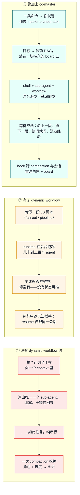

# cc-master

> For English, see [README.md](README.md).

一个「随处可用」（ship-anywhere）的 Claude Code 插件，把任意 main-session agent 一键变成长周期的 **master orchestrator（总指挥）**。

把一个跨度超过 24 小时的目标交给它：它会选对 dynamic-workflow 范式、写出稳定的并行脚本，并让主线程**真正地、有产出地**持续推进——一边把活派给后台，一边在等待的空档里主观能动地做事——全程熬过反复的 context compaction，并能跨会话续上。

---

## 为什么要有它：三种范式，并排一看便知

Dynamic workflows（随 Opus 4.8 一同发布）给了 Claude Code 真正的并行能力。但对一个**长周期**目标来说，仍有两处空白：官方模型只承诺主会话**保持响应**（不被阻塞），从不承诺总指挥**保持产出**（自驱找活）；而且没有任何机制能把你的「角色」和「进度」带过一次 compaction。cc-master 填的正是这块空白。

下面是同一个长目标——*「把 9 个 domain 迁移到新 schema」*——三种跑法的对照：



|  | ① 之前 | ② Dynamic workflows | ③ cc-master |
|---|---|---|---|
| **并行度** | 一次一个 sub-agent | 几十到上百个 agent | shell + sub-agent + workflow 混合 |
| **等待时的主线程** | 阻塞，或亲自上手 | 响应但空转 | 主观能动：验收 · 前瞻 · HITL · 沉淀 |
| **能否熬过 compaction** | 否 | 否 | 能——角色 + board 被重注 |
| **跨会话续接** | 否 | 仅限同一会话 | 能——靠 board 文件重新认回 |
| **端点验收** | 临时随手 | 写在脚本里 | 总指挥独立验收 |

cc-master 不是要取代 dynamic workflow——它把后者**包了进来**。workflow runtime 只是它指挥的三种后台手段之一。

---

## 安装

```bash
git clone https://github.com/nemori-ai/cc-master.git
ln -s "$(pwd)/cc-master" ~/.claude/plugins/cc-master
```

然后重启 Claude Code（或运行 `/reload-plugins`），让插件被识别。

## 使用

```
/cc-master:as-master-orchestrator <目标>   # bootstrap 一块 board，并就此化身总指挥
/cc-master:status                          # 渲染 board 摘要 + 校验「窄腰」契约
/cc-master:stop                            # 归档 board 并收尾（board 保留，不删除）
```

给 `as-master-orchestrator` 喂一个值得它出手的目标（量级上 >24h、含许多可独立推进的单元）。总指挥会把它拆成依赖图，依赖一满足就把后台活派出去，并持续推进主线程，直到万事皆「已完成 / 已验收 / 在等你拍板」。

---

## 工作原理

这个插件 = **命令 + 2 个 skill + hooks + 一份 board 文件**，三件套各有各的寿命：

```
cc-master/
├── .claude-plugin/plugin.json          清单（manifest）
├── commands/
│   ├── as-master-orchestrator.md       bootstrap —— 化身总指挥
│   ├── status.md                       汇总 board 进度 / 健康度
│   └── stop.md                         归档 / 置 board 非活跃
├── skills/
│   ├── orchestrating-to-completion/    Skill A —— 编排方法论（魂在这）
│   └── authoring-workflows/            Skill B —— 怎么写 workflow 脚本
└── hooks/
    └── scripts/{bootstrap-board, verify-board, reinject}.sh
```

- **命令**是一次性开机引导——你主动触发，它把「我是 master orchestrator」的哲学与操作纪律灌进来，并开好 board。
- **skill**是按需调阅的深度手册——跑编排循环时翻 Skill A，写 workflow 脚本时翻 Skill B。
- **hook**是熬过 compaction 的「记忆续命」——上下文被压缩后（或收到通知时），自动把「你是总指挥 + 这是你的 board」重注回来，让角色与待办不因健忘而失守。

### 那块 board

board 是总指挥为一个长任务存的**存档文件**——一张带状态的任务依赖图。它既是熬过 compaction 的记忆，又是 hook（一个 shell，读不到 agent context）唯一能读到的编排状态窗口。board 落在可配置的 home 里——设了 `$CC_MASTER_HOME` 就用它，否则用 `<project>/.claude/cc-master/`——且每次编排各得一份可按时间排序的独立文件，并发跑也互不冲突。它是**单一真理源**（内建的 `Task*` 工具顶多算一份非权威的草稿镜像），并已被 gitignore。

### 它教的三种后台手段

cc-master 教总指挥用三种「随处可用」的可靠手段来推进主线程：

1. **后台 shell** —— 长跑命令以 detached 方式启动，主线程照常前进。
2. **Sub-agent（`run_in_background`）** —— 一个独立、终结性的推理任务，完成后整合回来。
3. **Workflow** —— dynamic-workflow 脚本（fan-out / pipeline / loop），做结构化的并行编排。

它**有意不用** **agent-teams** 和 **scheduled routines**：两者都不够「随处可用」（前者藏在实验开关后面，后者需要 claude.ai 账户、且在 Bedrock/Vertex/Foundry 上不可用），因此被设计性地排除在外。

### Bootstrap：三层保证

board 是否存在，**不依赖 agent 听不听话**：

1. **`UserPromptSubmit`** 检测到命令体里的 sentinel → 确定性地建好一个空 board 骨架 + 把其确切路径和总指挥角色注入进来。
2. **agent** 填上 goal + DAG ——唯一的非机械步骤，且锚定在一个已经存在的文件上。
3. **`Stop`** 自门控于 home：若有活跃 board 却零任务，它就 `block` 住对话并要求修复。（而 `SessionStart` 负责在每次 compaction 后、以及 resume 时重注角色 + board。）

---

## 贡献与测试

测试套件覆盖了 hook 脚本（bash）和内容契约（Node 内建 test runner——board schema、skill/命令结构）：

```bash
./run-tests.sh
```

需要 Node 22+ 与 bash。对 workflow 脚本而言，harness 本身就是权威校验器，所以这里**有意不**维护一个独立的 workflow linter——理由见 [`skills/authoring-workflows/SKILL.md`](skills/authoring-workflows/SKILL.md) 第 3 节。

贡献时请：保持 board 的**窄腰**（那一小撮 hook 依赖的字段）稳定；保持两个 skill 自包含、不重叠（Skill A = 主线程编排，Skill B = 脚本内部写法）；提 PR 前先把测试跑一遍。

---

## 致谢

这个插件是站在先行者的肩膀上的：

- **[Claude Code](https://code.claude.com/docs/en/workflows)（Anthropic）** —— 感谢 dynamic-workflow runtime 本身，以及 [`/deep-research`](https://claude.com/blog/a-harness-for-every-task-dynamic-workflows-in-claude-code)——它是 fan-out → 对抗验证 → 综合 这一范式的官方样板实现。正是 harness 自带的 launch 期与 runtime 期校验，才让 Skill B 得以「教契约」而非「再造一个 linter」。
- **[ray-amjad/claude-code-workflow-creator](https://github.com/ray-amjad/claude-code-workflow-creator)** —— 社区事实标准的 authoring skill。Skill B（`authoring-workflows`）的整体骨架借鉴了它：一份程序化的 `SKILL.md`，外加 `references/{api-reference, patterns}` 与 `assets/{templates, examples}`。
- **[obra/superpowers](https://github.com/obra/superpowers)** —— 它的 `dispatching-parallel-agents` 是生态里少有的、明确主张「把主 agent 的 context 留给协调工作」之处——正是 cc-master「主线程不空转」论点的种子。整个开发也是在 superpowers 的纪律下 dogfood 出来的（brainstorming → 写 plan → TDD → review）。
- 我们提炼进 Skill B 范式库的那些社区文章—— [alexop.dev](https://alexop.dev/posts/claude-code-workflows-deterministic-orchestration/)、[claudefa.st](https://claudefa.st/blog/guide/development/dynamic-workflows)，以及 Anthropic 的 [*A harness for every task*](https://claude.com/blog/a-harness-for-every-task-dynamic-workflows-in-claude-code)。
- **[barkain/claude-code-workflow-orchestration](https://github.com/barkain/claude-code-workflow-orchestration)** —— 它的「软约束」轻推（soft enforcement，「别让主 agent 亲自上手干活」）与 cc-master「指挥绝不演奏乐器」的红线在结构上同根同源。

支撑本设计的研究都在 [`design_docs/research/`](design_docs/research/)。

---

## 了解更多

- [`design_docs/spec.md`](design_docs/spec.md) —— 完整设计 spec。
- [`design_docs/research/`](design_docs/research/) —— dynamic-workflow 范式背后的四份研究报告（机制、社区、LLM-Compiler 谱系、异步并行方法论）。

## 许可证

[MIT](LICENSE) © 2026 cc-master contributors
