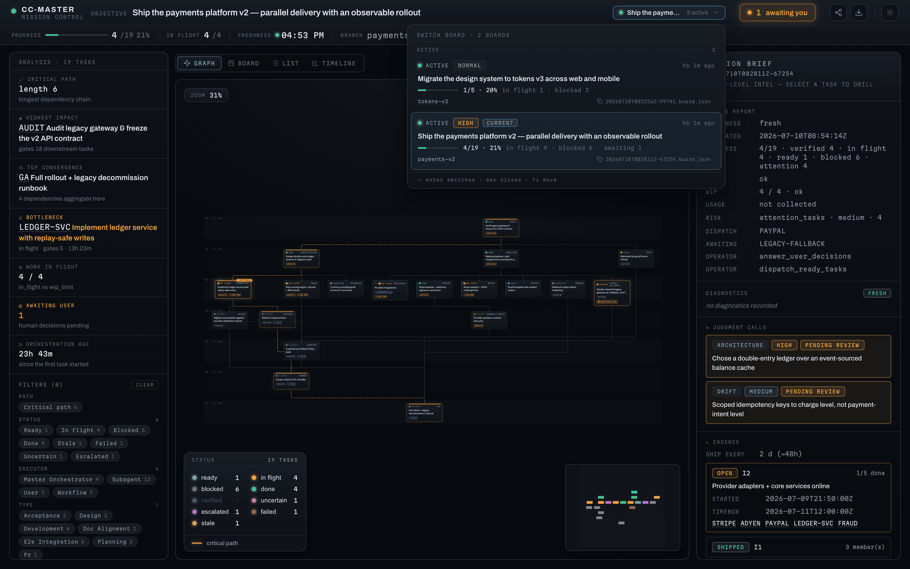

# cc-master

[](https://github.com/nemori-ai/cc-master/releases/tag/v0.20.0)
[](https://github.com/nemori-ai/cc-master/releases/tag/ccm-v0.21.0)
[](design_docs/harnesses/)
[](https://github.com/nemori-ai/cc-master/actions/workflows/ccm-ci.yml)
[](LICENSE)

> For English, see [README.md](README.md)。

**给它一个大目标，和一份预算。然后去忙你自己的。**

它会把一个受支持的 coding agent 会话变成长程工作的项目负责人。你出主意、在真正的大事上拍板；它帮助拆解、并行调度、跟踪进度和额度，并依据明确目标检查结果。board 能跨 context reset 和显式 session handoff 保留，不再把整场工作的记忆押在一次对话上。

它这份「靠谱」背后有实际机制：可以**推演上千遍**估算交付时间和最可能拖期的步骤；把**全机缓存 quota posture**呈现给总指挥，让调速有证据；Claude Code 在宿主支持且已有授权时还能使用账号池。Codex 和 Cursor 都不会自动换号。这些是决策辅助和操作护栏，不保证 provider 限额、估算或交付日期永远没有意外。

> **你不用再当那个什么都得盯着的人。**

但别误会——它**不是替你许个愿、AI 就把一切包圆**。品味、设计、方向这些只有你能拍的事，**始终是你的**；它接走的只是会把你淹没的拆解、调度、盯梢、记账。它甚至专门**教 AI 在该问你的时候停下来问你**——cc-master 的 skills 里就有大量「何时该把人请回来」的哲学与方法论，是把判断权**交还**给你、不是替你拍板。说到底它做的就一件事：在 AI 辅助编程的时代，**帮你把注意力重新分配到真正值得你花的地方**。


```
/cc-master:as-master-orchestrator 把我的想法做成能用的东西
```

一句话建立一份可持续的计划。总指挥可以让多路 worker 保持推进，并在需要你的判断或新授权时带着 decision package 回来。

这句话会被当作**需求证据，而不是原样抄成执行目标**。在建立任务图之前，总指挥会先把请求改写成简短、可验收的 Goal Contract；只有会实质改变 outcome、范围、验收、约束或权限边界的歧义才问你。复杂或长程目标会把完整背景独立存成由 board 链接的版本化 Goal Brief，resume 时校验 hash。目标真变了就新开 revision、重审任务图，不会悄悄扩 scope 跑偏。

---

## 这说的是不是你

- **🚀 你有想法，但不是工程师。** 你说得清要什么，可一个要好几天、千头万绪的东西，你没法盯着它一路做完——你缺的是一个**靠谱的项目负责人**。它就是。
- **🔧 你是工程师，但不想当"管事的"。** 你想专心解技术难题，不想去拆活、排工、算账、盯一堆任务还得不停做判断。**它把"管理"接走，你留在你擅长、也喜欢的地方。**
- **🧭 你在带团队。** 你想把自己变成十个自己。**它替你扛下所有琐碎调度，你只管定方向、拍大事。**

三种人，缺的是同一样东西：**一个能替你把事情管到底、还会算账的脑子。**

---

## 它到底替你做了什么

把一个大活交给普通的 AI，你会很快发现：它聊着聊着就**忘了自己在干嘛**；一次只能干一件、你得在旁边一步步喂；闷头一扎进去，可能**把你这个月的额度一口烧光**；要么三句一问烦死你，要么自作主张跑偏，最后还跟你说"差不多做完了"——其实没有。

cc-master 把这些全接管了，像个真正会算账的项目负责人那样：

- **🧩 拆活 + 一队人一起上。** 把大目标拆成有先后的小步，能同时干的就调一队 AI 并行开工。而且它不瞎拆——会算出**哪条链决定整个项目啥时候完**（临界路径），盯着那条使劲。
- **🌐 把整台机器当成 worker pool。** 总指挥不受当前 origin harness 限制：它可以查看本机 Claude Code、Codex、Cursor IDE、Cursor Agent 的独立 surface，读取目标 CLI 的真实 help，再通过 `ccm worker` 显式启动一个 session-bound worker。最终选择和结果验收仍由 origin session 负责。
- **🔮 开工前就告诉你啥时候完。** 它跑几千次模拟，给你一个**概率**："五成把握周三完、九成把握周五完"，还点出哪个环节最可能拖后腿。这本来是项目经理拿 Excel 算半天的活，现在一条命令、几十毫秒。
- **💰 让预算决策可见。** 全机缓存 posture 与 selected-target usage advice 帮它决定配速；missing、stale、unknown 仍保持未知。花费权限或余量不清楚时，应当减速或询问，而不是编造确定性。
- **⚡ 管理限制，而不是无视限制。** Claude Code 只有在既存 policy 或用户明确授权下才可以换号。Codex 只把 7d 当 hard window（rolling 24h 只是 advisory）；Cursor 按订阅 **billing period** 配速。Codex 和 Cursor 都不会自动换号。
- **🧠 留下一本持久账。** board 会跨 context reset 和显式 session handoff 保留 goal revision、tasks、decisions 与已登记 runtime agents。resume 仍需按实时证据重新对账；持久化不代表每个子进程都能跨 session 存活。
- **🙋 只在真正重要的事上问你。** 小决定它自己拿主意；只有"这事得你拍板"的，它才停下来、把来龙去脉讲清楚、等你一句话。
- **🏁 它有明确的完成闸。** 收尾前会对当前 Goal Contract revision 逐条检查：每件事真做完了吗、该问你的都问了吗、后台有没有悄悄挂掉？worker terminal 只是证据，不会自动等于父任务验收通过。

我们追求的体验是：开头给一个清楚的主意，中途只处理少量准备充分的判断。真实开发仍可能出现失败、provider 不可用或需要你介入的新决定。

---

## 看它干一次，从头到尾

> 你扔下一句：**"把我的 app 翻译成 6 种语言。"** 然后去睡觉。

- **它先想清楚顺序**：得先把要翻的词抽出来、搭好框架，6 种语言才能各翻各的。于是它先干打底的活，再把 6 种语言**同时**派出去。
- **打底的活用好一点的 AI（贵但稳），翻译的活用便宜的 AI**——省钱又不耽误质量，该精打细算的地方它都算过。
- 翻到一半，**冒出一个只有你能定的问题**："产品里的专有名词，翻译还是保留英文？" 它**立刻记下来等你**，同时手上别的语言一刻没停。
- 干着干着**额度快到上限**了，缓存 posture 与 selected-target advice 提醒它放慢节奏；Claude Code 可按已有授权策略选择另一账号，Codex 和 Cursor 则留在当前登录态。
- **你回来时**，board 会清楚展示哪些已经完成、哪些已独立核验，以及那个专有名词决定是否仍阻塞验收。

从头到尾，你只说了一句话、拍了一个板。


---

## 什么时候**别**用它

一个改一两行、十分钟搞定的小活——直接干就好，别请这个"项目负责人"，那是杀鸡用牛刀、反而更慢。**它是为那种"大到你一个人盯不过来、要好几天、要同时推很多条线"的目标准备的。** 活越大、越乱、越久，它越值。

---

## 它其实是个什么（给好奇的人）

cc-master 是一套**多 agent harness 兼容的插件系统**，背后是三样东西搭起来的：一层薄薄的**指挥逻辑**（教 AI 怎么当总指挥）、一个能做**运筹学估算和配速**的引擎、以及把这些能力投射到不同 agent host 命令、prompt、skill、hook、settings 表面的 harness adapter。

源码采用 paragoge 式 `plugin/src -> plugin/dist/<host>` 模型：共享 runtime skills 放在 canonical 源里，hooks 先建 host 无关的产品契约、再落各 host 的原生实现，每个 harness 都生成自己的 adapter 产物。插件版本线是一条；release asset 按 harness 拆分，例如 `cc-master-plugin-claude-code-<version>.zip`、`cc-master-plugin-codex-<version>.zip` 和 `cc-master-plugin-cursor-<version>.zip`。

我们对「做到了什么」和「还在做什么」分得很清楚。当前 adapter 包含 Claude Code、Codex 和 Cursor；全局 `ccm` 进程边界让任意 origin 都能看到同一套全机 inventory、缓存 quota posture、model-policy 视图、raw worker wrapper 与 Agent Registry。Cursor IDE plugin 和 Cursor Agent CLI 是两个独立 surface：安装或登录其中一个，不证明另一个可用。board 与已登记 agent 状态落在 `ccm` 及其只读 web viewer 上。**准确的 current / partial / target 边界以 [产品功能手册](design_docs/feature-manual.md) 和 [cross-harness capability model](design_docs/cross-harness-orchestration-capability-model.md) 为准**，README 不复制这两份矩阵。

当前 cross-harness worker 刻意保持窄小：`ccm worker help` 解析本机目标 CLI 的真实 agent-command help，`ccm worker run` 透传调用方选定的参数、stdin 与 cwd，并管理一次有界、同步、session-bound 的进程。它不是自动路由或 fallback、统一 provider API、常驻 daemon，也不提供安全认证。`ccm agent` 同样只是登记、关联、探测和查看 worker 的可观测 registry，不负责 spawn。model-policy 中的条目在有 live qualification 和 admission 证据之前都只是 candidate 与 advisory。

给贡献者：改 `plugin/src`，不要手改 `plugin/dist`。Skills 走 SAP（`canonical/` + `adapters/<host>/strategy.yaml`）；hooks 走 PHIP（`_manifest/`、`_hosts/<host>/`、`implementations/<host>`）。重新生成 adapter：

```bash
bash scripts/sync-plugin-dist.sh              # Claude Code adapter
bash scripts/sync-plugin-dist.sh --host codex # Codex adapter
bash scripts/sync-plugin-dist.sh --host cursor # Cursor adapter
```

任何影响 plugin 的源码改动，push 前都要确保生成物一起提交。每个 clone 先跑一次 `bash scripts/install-git-hooks.sh`；它会安装本仓 pre-push hook，每次 push 前自动跑 `bash scripts/check-plugin-dist-sync.sh`，如果 `plugin/dist` 需要重新生成并提交，就阻止 push。

项目 meta-skills 放在 `.claude/skills`。Codex 项目级 skills 从 `.agents/skills` 发现，所以改完 meta-skills 后同步一次：

```bash
bash scripts/sync-codex-skills.sh
```

harness 兼容资料放在 [`design_docs/harnesses/`](design_docs/harnesses/)。那里是本仓校对后的本地资料源：包含从 paragoge 迁移来的 adapter 模型，也包含当前 Claude Code / Codex / Cursor 的真实机制结论。

---

## 上手

一条命令，把两样东西——`ccm` 引擎和 cc-master 插件——装好。两者**各自独立版本**（[ADR-022](adrs/ADR-022-version-line-decoupling.md)）：插件走裸 `vX.Y.Z` tag，`ccm` 走 `ccm-vX.Y.Z` tag，各自独立的发版线。安装器各取各线的最新版：

```bash
# 各取两条线（插件 + ccm）的最新版
curl -fsSL https://raw.githubusercontent.com/nemori-ai/cc-master/main/install.sh | bash

# …或分别 pin 某条线的版本——两个 flag 各自可选、各自独立，
# 省掉哪个、哪个就解析为本线最新：
curl -fsSL https://raw.githubusercontent.com/nemori-ai/cc-master/main/install.sh | bash -s -- \
  --ccm-version ccm-v0.21.0 --plugin-version v0.20.0

# 只 pin 一条线、另一条留最新（例如锁住 ccm、插件取最新）：
curl -fsSL https://raw.githubusercontent.com/nemori-ai/cc-master/main/install.sh | bash -s -- --ccm-version ccm-v0.21.0

# 显式指定 harness，或分发到本机所有已安装且支持的 harness：
curl -fsSL https://raw.githubusercontent.com/nemori-ai/cc-master/main/install.sh | bash -s -- --harness claude-code
curl -fsSL https://raw.githubusercontent.com/nemori-ai/cc-master/main/install.sh | bash -s -- --harness cursor
curl -fsSL https://raw.githubusercontent.com/nemori-ai/cc-master/main/install.sh | bash -s -- --all-harnesses
```

它会探测你的操作系统和架构，下对应的 `ccm` 二进制、放进 PATH，再识别本机已安装的 harness，并把对应 adapter 包分发到每个受支持目标。每个联网下载的 release asset 在安装前都会先下载同一 release 的 `SHA256SUMS`，按精确文件名校验；清单缺失、条目缺失或 digest 不匹配都会停止安装。Claude Code 安装走 `claude` CLI（≥ v2.1.195）。Codex 安装会注册本地 Codex marketplace/plugin，命令入口走插件分发的 `$cc-master-*` 技能（如 `$cc-master-as-master-orchestrator ...`）。Cursor 安装通过 local plugin 面把 adapter 发布到 `~/.cursor/plugins/local/cc-master`。安装器在**所有模式**下都强制需要 Node.js 22 或更高版本，包括 pin 版本和 `CC_MASTER_INSTALL_LOCAL` 本地离线安装；此外还需 `unzip` 和一个 SHA256 工具（`sha256sum` / `shasum` / `openssl`），联网安装另需 `curl` 或 `wget`。每个 harness adapter 还可能需要对应 harness 的 CLI 或 config 目录已经存在。`ccm` 引擎是**硬前置**——没有它插件就不会开工——所以安装器先把它就位。

checksum 失败按 release 完整性失败处理，不提供绕过安装。请重试；若仍失败，先检查 GitHub release assets 再继续。`CC_MASTER_INSTALL_LOCAL` 仍保持离线路径：本地目录有 `SHA256SUMS` 就校验，没有则明确改为信任该本地目录，不联网取清单。

> **想自己手动装，或从源码跑？** clone 本仓，先用 `bash scripts/sync-plugin-dist.sh --host <harness>` 生成你要的 adapter，再走对应 harness 的原生安装路径。Claude Code 可以指向 `plugin/dist/claude-code`；Codex 应通过一个本地 marketplace 注册 `plugin/dist/codex`（命令入口为 `$cc-master-*`）；Cursor 可以把 `plugin/dist/cursor` 复制到 `~/.cursor/plugins/local/cc-master`。你仍需一个 `ccm` 在 PATH 上——从最新 `ccm-v*` release 的 **Assets** 下 `ccm-<os>-<arch>`、重命名为 `ccm`、`chmod +x`、放进 `~/.local/bin`。

**把 harness config 挪走了？** `CLAUDE_CONFIG_DIR` 仍只控制 Claude Code 自己的 settings、credentials 和 transcript projects；`CODEX_HOME` 控制 Codex home。cc-master 的运行时状态是 harness-neutral 的：board、版本化 Goal Brief、号池 registry、file vault、配额 sidecar 默认落在 `${CC_MASTER_HOME:-$HOME/.cc_master}`，除非你显式传 `--home`。

### Cursor 安装

```bash
curl -fsSL https://raw.githubusercontent.com/nemori-ai/cc-master/main/install.sh | bash -s -- --harness cursor
```

`ccm` 仍是硬前置（安装器会先装好它）。Cursor IDE adapter 落在 `~/.cursor/plugins/local/cc-master`；装完后请重开 IDE Agent session，让 hooks/rules 生效。另行安装的 `cursor-agent` CLI 是独立的 headless worker 与 quota surface。两者都按订阅 **billing_period** 信号配速，但都不能从另一侧推导安装、登录、entitlement 或 quota，也都不会自动换号。

### 状态栏（自动 · Claude Code）

在 Claude Code 上，cc-master 自带一条状态栏——context 进度条 + 你的 5h / 7d 配额用量，按各自用得多满**变色**。**你第一次跑任意 `ccm` 命令时，cc-master 会自动帮你配好它**（在你的全局 `settings.json` 写入 `statusLine.command`）。这条状态栏同时把 5h / 7d 配额信号喂给该宿主上的预测与配速。

提示：它**会覆盖你现有的 `statusLine`**（已先备份你原来的）。想还原你自己的：`ccm statusline uninstall`（恢复原值，并让 cc-master 不再覆盖回去）。想彻底关掉自动安装：设 `CC_MASTER_NO_AUTOINSTALL=1`。

Cursor **不用**这条 5h/7d 状态栏做配速——它在 `CC_MASTER_HARNESS=cursor` 下通过 `ccm usage advise` 读 dashboard 的 **billing_period** 账单周期。

然后通过你的 harness 入口给它一个目标：

```
# Claude Code
/cc-master:as-master-orchestrator <你的目标>

# Codex
$cc-master-as-master-orchestrator <你的目标>

# Cursor（Agent 会话 slash command）
/as-master-orchestrator <你的目标>
```

---

## 日常使用

你真正会敲的就这几条命令。会话内入口按 harness 不同而不同；`ccm …` 一律在你的**终端**里敲。

- **Start / resume** — Claude Code：`/cc-master:as-master-orchestrator <目标>` 或 `/cc-master:as-master-orchestrator --resume`；Codex：`$cc-master-as-master-orchestrator <目标>` 或 `$cc-master-as-master-orchestrator --resume`；Cursor：`/as-master-orchestrator <目标>` 或 `/as-master-orchestrator --resume`（装完后请重开 Agent session，让 hooks/rules 生效）。fresh 会先 framing/check Goal Contract 再建任务；resume 会先检查当前 revision 与 Goal Brief 再派发。
- **发现本机资源** — `ccm harness list --machine-wide --json` 列出受支持 harness 及其彼此独立的 execution surfaces；`ccm quota status --machine-wide --json` 读取它们的缓存 quota posture，不触发 provider refresh。
- **选择模型角色** — `ccm model-policy show --task <task-taxonomy> --json` 展示三路统一的 O / T1 / T2 / T3 角色与证据；candidate 是 advisory，不等于 certified 或自动选中。
- **查看 / 运行 worker** — `ccm worker help --harness <codex|claude-code|cursor-agent>` 读取本机目标的真实 agent-command help；然后显式运行 `ccm worker run --harness <...> --cwd /abs/repo -- <provider argv...>`。ccm 不会替你编造 provider flags 或 fallback chain。
- **查看已登记 worker** — `ccm agent list --json` 展示 board 的 runtime roster 与 lifecycle 证据。登记和 probe 增强可观测性，但不会 spawn worker，也不会把父任务标为完成。
- **Status** — `ccm status-report show`。生成 CLI 和 web viewer 共用的 JSON-backed board 状态报告。
- **View** — `ccm web-viewer open`。在浏览器里把实时计划打开成只读图；生命周期命令是 `ccm web-viewer start/open/status/stop/restart`（默认系统分配端口；服务已 wanted 时 `ccm upgrade` 后会自动 reconcile）。
- **Discuss** — Claude Code：`/cc-master:discuss <决定>`；Cursor：`/discuss <决定>`；Codex：`$cc-master-discuss <决定>`。当有决定等你拍板时使用。
- **Stop** — Claude Code：`/cc-master:stop`；Codex：`$cc-master-stop`；Cursor：`/cc-master-stop`（Cursor 内置 `/stop` 与此无关）。收尾并归档 board，以后可以继续 resume。
- **Handoff** — Claude Code：`/cc-master:handoff-to-new-session`；Codex：`$cc-master-handoff-to-new-session`；Cursor：`/handoff-to-new-session`。在换新会话前交接。
- **Retro** — Claude Code：`/cc-master:retro`；Codex：`$cc-master-retro`；Cursor：`/retro`。对进行中或已归档的 board 做一次只读复盘，把经验写进被编排项目自己（不写 board、不碰 GitHub）。
- **Distill** — Claude Code：`/cc-master:distill <retro-path...>`；Codex：`$cc-master-distill <retro-path...>`；Cursor：`/distill <retro-path...>`。把复盘里的候选经验蒸馏成目标项目的实际资产（纪律文档一句指针 / skill / workflow / subagent）——经用户批准的蒸馏计划把关，并走 feature-branch PR 收口（非 git 项目降级为变更草稿目录）。绝不碰 board、不调用 `ccm`。
- **`ccm account add|list|switch <email>`** — 在 Claude Code 上建备用账号池并调度，好让已有授权策略在某个窗口用紧时换号。这几条在终端里敲；token 全程 token-blind，绝不进 AI 的 context。Codex 和 Cursor 都不会自动换号。

同时跑着好几场编排？home 里每一块活着的 board，在 viewer 里一键即达：



> 日常就这一组。完整命令面（每个 `ccm` namespace 和 flag）在 [命令目录](plugin/src/skills/using-ccm/canonical/references/command-catalog.md)；哪些已落地、哪些还在路上，在 [产品功能手册](design_docs/feature-manual.md)。

---

## 想更深入

- **它能做的每一件事 + 诚实状态** → [产品功能手册](design_docs/feature-manual.md)
- **Cross-harness current / partial / target 边界** → [Capability model](design_docs/cross-harness-orchestration-capability-model.md)
- **贡献者 / 架构第一站** → [`AGENTS.md`](AGENTS.md)
- **完整设计** → [`design_docs/spec.md`](design_docs/spec.md)

---

## 致谢 · 许可证

站在先行者的肩膀上：[Claude Code](https://code.claude.com/docs/en/workflows)（Anthropic）、[claude-code-workflow-creator](https://github.com/ray-amjad/claude-code-workflow-creator)、[superpowers](https://github.com/obra/superpowers)、[claude-code-workflow-orchestration](https://github.com/barkain/claude-code-workflow-orchestration)。

[MIT](LICENSE) © 2026 cc-master contributors
