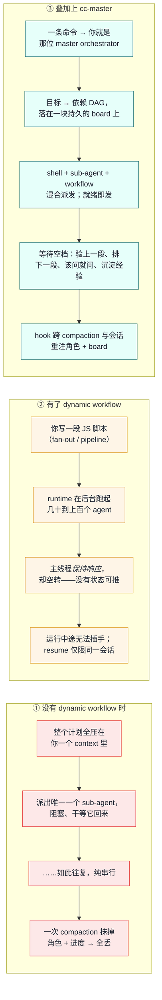

# cc-master

> For English, see [README.md](README.md)。


**把一个单会话装不下的大目标交给 Claude Code —— 让它自己指挥自己干到收尾。**

一个长周期目标，不该在下一次 context compaction 时就这么死掉。你把两天的活交给 agent，它干出了真进展，上下文一满、一次 compaction 之后，它就忘了自己正在指挥——只剩*装着忙、却什么都没产出*。cc-master 就是那个不会忘的层。

它是一个「随处可用」（ship-anywhere）的 Claude Code 插件，把任意 main-session agent 变成长周期的 **master orchestrator（总指挥）**：把目标拆成依赖图、把后台工作并行派发、在每一个等待空档里让主线程**有产出地**持续推进，并熬过反复 compaction 与跨会话续接、全程不丢线索。它**不是一个 framework**——只是命令 + 2 个 skill + hooks + 一份 board 文件。

```
/cc-master:as-master-orchestrator <一个值得花 >24h 的目标>
```

这一条命令就会 bootstrap 一块持久的 board，并把当前 session 化身为总指挥。**从 clone 到跑起来，60 秒。** ↓ 往下看它相比裸 Claude Code 到底多给了你什么。

---

## 三种范式，并排一看便知

Dynamic workflows（随 Opus 4.8 一同发布）给了 Claude Code 真正的并行能力——一段脚本就能 fan out 出上百个 agent。但对一个**长周期**目标来说，仍有两处空白：官方模型只承诺主会话**保持响应**，从不承诺总指挥**保持产出**；也没有任何机制能把你的**角色与进度带过一次 compaction**。cc-master 填的正是这块空白——它不取代 dynamic workflow，而是把它*包了进来*。

下面是同一个长目标——*「把 9 个 domain 迁移到新 schema」*——三种跑法的对照：



第 ③ 列的每一条断言都锚在一个真实机制上，不是营销话术：

|  | ① 之前 | ② Dynamic workflows | ③ cc-master | ③ 靠什么兑现 |
|---|---|---|---|---|
| **并行度** | 一次一个 sub-agent | 几十到上百个 agent | shell + sub-agent + workflow 混合 | 三种后台手段 |
| **等待时的主线程** | 阻塞，或亲自上手 | 响应但空转 | 主观能动：验收 · 前瞻 · HITL · 沉淀 | 决策程序（Skill A） |
| **能否熬过 compaction** | 否 | 否 | **能**——角色 + board 被重注 | `reinject.sh`（SessionStart hook） |
| **跨会话续接** | 否 | 仅限同一会话 | **能**——靠 board 文件重新认回 | board（持久存档文件） |
| **端点验收** | 临时随手 | 写在脚本里 | 总指挥独立验收 | `subagent-stop.sh` + 红线 6 |
| **配额感知** | 否 | 否 | **能**——感知 5h/7d 窗口 | `usage-pacing.js`（Stop hook） |

---

## 跟着跑一遍，从头到尾

理解 cc-master 最快的办法，是看一场编排怎么发生——而且看它一口气调动好几样能力。一个真实长目标进去，一块持久的 board、按难度分档的并行 worker、一个抛回给*你*的决策、一次临场 escalation、配额感知的 pacing、一个独立验收过的收尾出来。下面每一段 board JSON 都是磁盘上那份文件的**真实快照**——正是 hook 在决定「你能不能停」时读的那一份。

> **这个目标：** *把 web app 国际化到 6 个 locale——搭起 i18n 框架、抽取所有硬编码字符串、逐 locale 翻译、上线 locale 路由。* ——形态正是真实长任务的样子：一个共享地基，然后一堆想并行跑的独立 per-locale 工作，外加一个只有人能拍的板。

**第 1 拍 —— 一条命令建好 board。** `UserPromptSubmit` 看到命令体里的 sentinel，跑 `bootstrap-board.sh`，它在*agent 动手之前*就把 board 文件建好、把路径递回来：*「a fresh orchestration board was created at `<home>/…board.json` … 把目标拆成依赖 DAG、写 `tasks[]` … 然后跑决策程序。」* bootstrap 不指望 agent 记得维护状态——它直接递一块过去。

**第 2 拍 —— 拆图、给模型分档、把该你拍的抛出来。** 总指挥把目标拆成 DAG：一个万物依赖的临界根 `T0`（搭 i18n 框架 + 抽字符串）跑**强模型**，三个独立 locale 叶子 `de` / `ja` / `ar` 跑**廉价模型**（临界链上用强、float 上用廉）。有个决定不该总指挥替你做——*产品术语是翻译还是保留英文？正式还是非正式语气？*——于是它落成一个 `blocked_on:"user"` 节点，**立刻**抛给你，与其余一切并行。

```json
// INITIAL —— 根在飞；locale 叶子 blocked 等它；一个决策抛回给你
{
  "schema": "cc-master/v1",
  "goal": "Internationalize the app to 6 locales (i18n framework + per-locale translation + locale routing)",
  "owner": { "active": true, "session_id": "smoke-session-001", "heartbeat": "2026-06-08T10:00Z" },
  "git": { "worktree": "/repo/.worktrees/i18n", "branch": "feat/i18n-rollout" },
  "wip_limit": 4,
  "tasks": [
    { "id": "T0", "status": "in_flight", "deps": [], "model": "opus", "title": "i18n framework + string extraction" },
    { "id": "de", "status": "blocked", "deps": ["T0"], "blocked_on": "T0", "model": "haiku", "title": "translate locale: de" },
    { "id": "ja", "status": "blocked", "deps": ["T0"], "blocked_on": "T0", "model": "haiku", "title": "translate locale: ja" },
    { "id": "ar", "status": "blocked", "deps": ["T0"], "blocked_on": "T0", "title": "translate locale: ar (RTL)" },
    { "id": "D1", "status": "blocked", "deps": [], "blocked_on": "user", "title": "glossary + register decision" }
  ]
}
```

**第 3 拍 —— 熬过一次 compaction（最难的一环）。** 长任务意味着上下文会被填满、compaction 会*整个*抹掉「我是总指挥」这件事——而 agent 没法替自己重注它，因为「它曾有个角色」这份记忆正是被抹掉的那份。`SessionStart`（含 `source:compact`）时，`reinject.sh` 从 context **之外**重注：*「You are a cc-master master orchestrator. 你的 board 在 `<home>` … 按 goal 认回它 … 别重做已完成/已验收的活，先整合已完成的后台结果。」* board 带过了*进度*，hook 带过了*身份*。

**第 4 拍 —— 就绪即发，且随机应变。** `T0` 落地、在端点被验收（总指挥亲读 diff——green gate *不算*通过）。locale 叶子 `blocked → ready`，在 `wip_limit: 4` 下并行派发。然后计划撞上现实：`ar` 不只是翻译——右到左（RTL）排版要真功夫——于是总指挥把它 **escalate 成一个 `workflow`** 并重规划，而不是硬塞一个不再合身的叶子。与此同时 `usage-pacing.js` 察觉这轮已逼近 5h 配额墙，注入一条**非阻断**轻推；总指挥就此节流——降 WIP、推迟优先级最低的 locale——而非顶满硬撞。万一它想在 board 还剩 `ready` 活时收尾，`verify-board.sh` 当场拦死：*「这块 board 还有 `ready` 任务……停之前先把它处理掉。」*

**第 5 拍 —— 独立验收，再一道强制自检。** 叶子跑完、各自独立验收（总指挥亲验渲染出的 locale，不信 worker 的自报）。board *看着*完成了——于是 agent 想停。**全篇最重要的 hook 时刻：** goal-hook 不会凭「done」就放行。在完成态的第一次停，它 block 一次、逼一道对照*原始 goal* 的自检——并点出你那个术语表决策**仍未答**：*「(1) 每个需要用户拍板的点都 surface / 标 `blocked_on:"user"` 了吗？(2) 对照原始 goal，每件 to-do 真的都做完了吗？」* 只要还欠你一个决策，「done」就被拒。

```json
// DONE —— 每个工作节点已验收；那个用户决策已答并落实
{
  "schema": "cc-master/v1",
  "goal": "Internationalize the app to 6 locales (i18n framework + per-locale translation + locale routing)",
  "owner": { "active": true, "session_id": "smoke-session-001", "heartbeat": "2026-06-08T12:30Z" },
  "wip_limit": 4,
  "tasks": [
    { "id": "T0", "status": "done", "deps": [], "verified": true },
    { "id": "de", "status": "done", "deps": ["T0"], "verified": true },
    { "id": "ja", "status": "done", "deps": ["T0"], "verified": true },
    { "id": "ar", "status": "done", "deps": ["T0"], "mechanism": "workflow", "verified": true },
    { "id": "D1", "status": "done", "deps": [], "title": "glossary + register decision (answered)" }
  ]
}
```

**想要可跑的证明？** 这里叙述的 hook 链——bootstrap、reinject，以及每一个 `verify-board` 的 block/allow 决策——都被 `smoke.sh` 端到端跑过一遍（no jq、no node、no network），它逐步打印*发生了什么*和*hook 决定了什么*，外加 PASS/FAIL 退出码（兼作 CI 冒烟检查）：

```bash
bash examples/sample-orchestration/smoke.sh
```

完整逐步走查、连每一张 board 快照，都在 [`examples/sample-orchestration/walkthrough.md`](examples/sample-orchestration/walkthrough.md)。

---

## Quickstart

有两种受支持的跑法，按你的工作方式选——两条路径都只需 **Node 22+** 与 **bash**，别无他求。

### A. `--plugin-dir` —— 推荐（dev / dogfood）

让 Claude Code 直接指向一个 live 的 clone。对仓库的改动会在下一个 session 即时生效——**没有 cache、不用拷贝**。维护者本人就是这么跑的。

```bash
git clone https://github.com/nemori-ai/cc-master.git
cd cc-master
claude --plugin-dir .          # 本 session 从 live 仓库加载插件
```

`claude --plugin-dir /abs/path/to/cc-master` 在任何地方都能用，所以你可以在**另一个**项目里 dogfood cc-master。

### B. Marketplace + `enabledPlugins`（team / 稳定版）

先把这个仓库加为 marketplace，再在 settings 里启用插件。要在团队里共享同一个固定版本时，这是对的选择。**取舍：** enabled 的插件会被拷进 Claude Code 的 plugin cache，所以对你 clone 的 live 改动**不**会生效——想吃到改动必须 `claude plugin update`。

```bash
# 把本仓库加为 marketplace（URL、本地路径、GitHub repo 三种来源都行）
claude plugin marketplace add nemori-ai/cc-master
claude plugin install cc-master@cc-master
```

或者在 settings 里声明式启用。`enabledPlugins` 的值是一个以 `<plugin>@<marketplace>` 为键的**对象**（不是数组）：

```jsonc
// ~/.claude/settings.json
{
  "enabledPlugins": {
    "cc-master@cc-master": true
  }
}
```

> 一句话判断：在迭代插件本身 → `--plugin-dir`（live）。给团队钉一个版本 → marketplace + `enabledPlugins`（cached）。

加载后，给它一个值得它出手的目标（量级上 >24h、含许多可独立推进的单元）。完整命令集：

```
/cc-master:as-master-orchestrator <目标>   # bootstrap 一块 board，并就此化身总指挥
/cc-master:status                          # 渲染 board 摘要 + 校验「窄腰」契约
/cc-master:stop                            # 归档 board 并收尾（board 保留，不删除）
```

---

## 六愿景 charter（C1–C6）

cc-master **致力于让** Claude Code agent 化身一个具备六项能力的 master orchestrator。这些是**指导设计的方向目标，而非「六条已全部兑现」的声称**——状态列对「今天已落地 vs 仍是 design-only」保持诚实：

| # | 能力 | 状态 | 今天怎么兑现 |
|---|---|---|---|
| **C1** | 异步并行多线程推进、把目标完整落地——不是干到一半，而是一路到底 | 🟢 Live | 三种后台手段 + 决策程序 loop + `Stop` 门强制「真的全做完」 |
| **C2** | 控制 token 消耗*速度*——节流，而非顶满 | 🟢 Live | `usage-pacing.js`（非阻断的 5h/7d burn-rate 警告）+ `cc-usage.sh` |
| **C3** | 把握自主决策与寻求人类接入的边界 | 🟢 Live | 红线 + `blocked_on:user` 节点 + `Stop` 门列出未答用户决策 |
| **C4** | 边学边分解、管理、更新、重规划目标 | 🟢 Live | board DAG + CPM 拆解 + resume 报出悬挂的 `stale`/`escalated` 节点 |
| **C5** | 在合理燃烧速率*之下*最大化吞吐 | 🟢 Live | WIP cap（~75% 利用率）+ 免费 float 并行 + `posttool-batch.sh` 软警告 |
| **C6** | 按复杂度、难度、时长选对模型 | 🟡 Partial | **复杂度/难度**维已落地（per-node `agent({model})` 选档）；**时长**维仍 design-only |

> 🟢 Live · 🟡 Partial · ⚪ Design-only。哪些能力已落地 vs design-only 由 [`design_docs/vision-landing-tracker.md`](design_docs/vision-landing-tracker.md) 度量；完整 charter 的单一真相源在 [`design_docs/spec.md` §1.0](design_docs/spec.md)。

---

## 工作原理

这个插件 = **命令 + 2 个 skill + hooks + 一份 board 文件**，每件各有各的寿命：

```
cc-master/
├── .claude-plugin/
│   ├── plugin.json                     清单（manifest）
│   └── marketplace.json                marketplace 条目（安装方案 B）
├── commands/
│   ├── as-master-orchestrator.md       bootstrap —— 化身总指挥
│   ├── status.md                       汇总 board 进度 / 健康度
│   └── stop.md                         归档 / 置 board 非活跃
├── skills/
│   ├── orchestrating-to-completion/    Skill A —— 编排方法论（魂在这）
│   └── authoring-workflows/            Skill B —— 怎么写 workflow 脚本
└── hooks/
    └── scripts/{bootstrap-board, reinject, verify-board,    bash
                 subagent-stop, posttool-batch}.sh +
                 usage-pacing.js                             node
```

- **命令**是一次性开机引导——你主动触发，它把「我是 master orchestrator」的哲学与操作纪律灌进来，并开好 board。
- **skill** 是按需调阅的深度手册——跑编排循环时翻 Skill A，写 workflow 脚本时翻 Skill B。
- **hook** 是总指挥的运行时——它熬过 compaction（重注「你是总指挥 + 这是你的 board」）、把关收尾、捎来后台 sub-agent 的完成、对过度派发软警告、感知 5h/7d 配额墙。只在结构化 JSON 解析划算处（从 JSONL 算 usage）才用 `node`，其余一律 bash（[ADR-006](adrs/ADR-006-hooks-may-use-node-js.md)）。

### 它教的三种后台手段

cc-master 教总指挥用三种「随处可用」的可靠手段来推进主线程：

1. **后台 shell** —— 长跑命令以 detached 方式启动，主线程照常前进。
2. **Sub-agent（`run_in_background`）** —— 一个独立、终结性的推理任务，完成后整合回来。
3. **Workflow** —— dynamic-workflow 脚本（fan-out / pipeline / loop），做结构化的并行编排。

它**有意不用** **agent-teams** 和 **scheduled routines**：两者都不够「随处可用」（前者藏在实验开关后面，后者需要 claude.ai 账户、且在 Bedrock/Vertex/Foundry 上不可用），因此被设计性地排除在外。

### Bootstrap 与收尾，由 hook 担保

board 是否存在，**不依赖 agent 听不听话**；总指挥也无法偷偷提前撂挑子。六个 hook，横跨五个事件：

1. **`UserPromptSubmit`**（`bootstrap-board.sh`）检测到命令体里的 sentinel → 确定性地建好一个空 board 骨架 + 把其确切路径和总指挥角色注入进来。这也是**武装动作**（见下）。
2. **`SessionStart`**（`reinject.sh`）在每次 compaction 后、以及 resume 时重注角色 + board——resume 时还会**报出上一轮 plan 更新未对账遗留的 `stale`/`escalated` 悬挂节点**。
3. **`Stop`**（`verify-board.sh`）对**本 session** 的 active board 跑一道纯 bash 的门（按 `owner.session_id` 过滤，所以并发编排互不干扰）。board 为空、或还剩 `ready`/`uncertain` 的活，就 **block** 住这次 Stop；当 board 看起来完成了，它会逼一次对照 goal 的**自检**——并**列出未答的 `blocked_on:user` 决策**——才放行；还有一道 fuse（连续 block 5 次）兜底，防止误判把 agent 永久焊死。
4. **`Stop`** 上还跑 `usage-pacing.js`（node）：读本地 usage JSONL、算 5h/7d burn-rate，临近撞墙时注入**非阻断**的 pacing 警告——它绝不 block，也绝不替你决定**怎么 pace**（那是总指挥的判断）。
5. **`SubagentStop`**（`subagent-stop.sh`）在后台 sub-agent 完成时触发：提醒总指挥去对账 board、整合结果，并**在自己的端点独立验收**（gate-green ≠ passed）。
6. **`PostToolBatch`**（`posttool-batch.sh`）在一批并行调用后，数 in_flight 任务对 board 的 `wip_limit`，过度派发时**软警告**——绝不 block，并行自由照旧。

**每个 hook 未武装即休眠。**「武装」由磁盘上的 board 派生：hook 只在**本 session 拥有一块 active board**时才动作（`owner.active:true` **且** `owner.session_id` == hook stdin 的 `session_id`；sid 为空则降级匹配任一 active 板，保 compaction 鲁棒）。在那之前——同一宿主里任何普通编码 session——每个 hook 都完全静默。`bootstrap-board.sh` 是唯一例外：它**就是**那个武装动作（建板时盖上 `owner.session_id`）。解除武装 = `/stop`。详见 [ADR-007](adrs/ADR-007-hook-arming-gate.md)。

### 那块 board

board 是总指挥为一个长任务存的**存档文件**——一张带状态的任务依赖图。它既是熬过 compaction 的记忆，又是 hook（一个 shell，读不到 agent context）唯一能读到的编排状态窗口。board 落在可配置的 home 里——设了 `$CC_MASTER_HOME` 就用它，否则用 `<project>/.claude/cc-master/`——且每次编排各得一份可按时间排序的独立文件，并发跑也互不冲突。它是**单一真理源**（内建的 `Task*` 工具顶多算一份非权威的草稿镜像），并已被 gitignore。board 有一条**窄腰**：那一小撮 hook 依赖的固定字段（`owner.session_id`、task 的 `status` 值、`active`）；其余皆为 flexible。让这条窄腰保持稳定，是 bash hook 与 agent 之间那条命根子的契约。

---

## 贡献

开发闭环 = 一次 clone + 两道门——`./run-tests.sh`（hook 测试 + 内容契约）与 `claude plugin validate .`。设计不变量（hook 限 bash + node/JS——ADR-006、稳定的 board 窄腰、两个不重叠的 skill、「指挥绝不演奏乐器」红线、ship-anywhere、所有 hook 武装后才激活 dormant-until-armed——ADR-007）都写在 [CONTRIBUTING.md](CONTRIBUTING.md) 里。提 PR 前先读它。

---

## 致谢

这个插件是站在先行者的肩膀上的：

- **[Claude Code](https://code.claude.com/docs/en/workflows)（Anthropic）** —— 感谢 dynamic-workflow runtime 本身，以及 [`/deep-research`](https://claude.com/blog/a-harness-for-every-task-dynamic-workflows-in-claude-code)——它是 fan-out → 对抗验证 → 综合 这一范式的官方样板实现。正是 harness 自带的 launch 期与 runtime 期校验，才让 Skill B 得以「教契约」而非「再造一个 linter」。
- **[ray-amjad/claude-code-workflow-creator](https://github.com/ray-amjad/claude-code-workflow-creator)** —— 社区事实标准的 authoring skill。Skill B（`authoring-workflows`）的整体骨架借鉴了它：一份程序化的 `SKILL.md`，外加 `references/{api-reference, patterns}` 与 `assets/{templates, examples}`。
- **[obra/superpowers](https://github.com/obra/superpowers)** —— 它的 `dispatching-parallel-agents` 是生态里少有的、明确主张「把主 agent 的 context 留给协调工作」之处——正是 cc-master「主线程不空转」论点的种子。整个开发也是在 superpowers 的纪律下 dogfood 出来的（brainstorming → 写 plan → TDD → review）。
- 我们提炼进 Skill B 范式库的那些社区文章—— [alexop.dev](https://alexop.dev/posts/claude-code-workflows-deterministic-orchestration/)、[claudefa.st](https://claudefa.st/blog/guide/development/dynamic-workflows)，以及 Anthropic 的 [*A harness for every task*](https://claude.com/blog/a-harness-for-every-task-dynamic-workflows-in-claude-code)。
- **[barkain/claude-code-workflow-orchestration](https://github.com/barkain/claude-code-workflow-orchestration)** —— 它的「软约束」轻推（soft enforcement，「别让主 agent 亲自上手干活」）与 cc-master「指挥绝不演奏乐器」的红线在结构上同根同源。

支撑本设计的研究都在 [`design_docs/research/`](design_docs/research/)，完整设计 spec 在 [`design_docs/spec.md`](design_docs/spec.md)。

---

## 许可证

[MIT](LICENSE) © 2026 cc-master contributors
